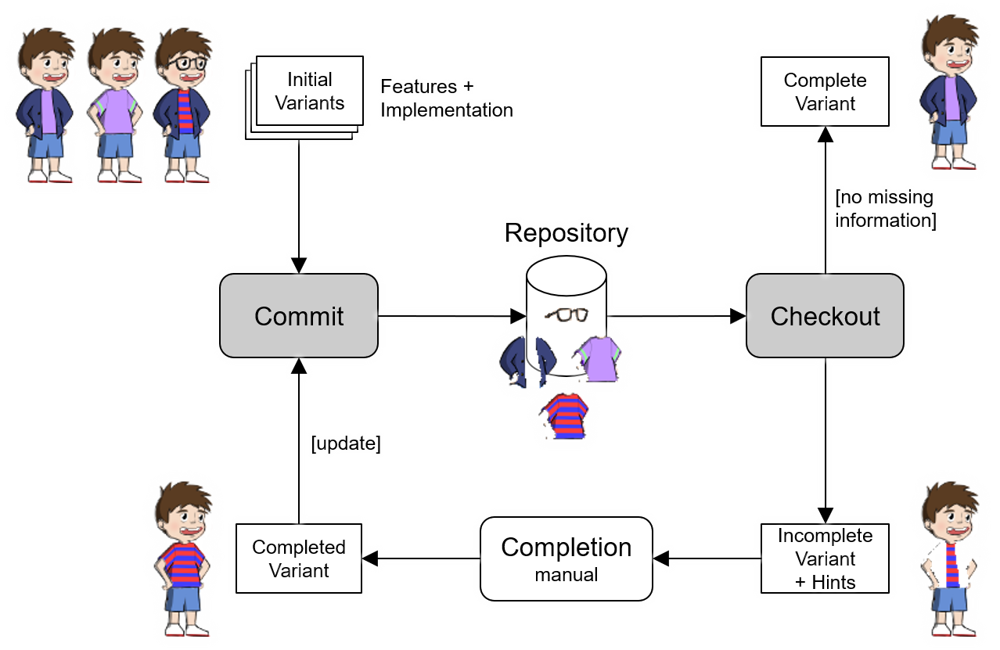
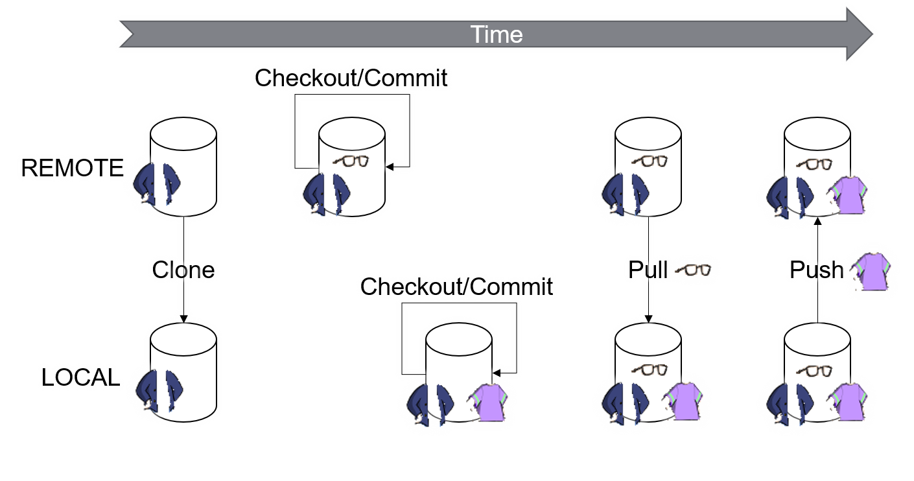
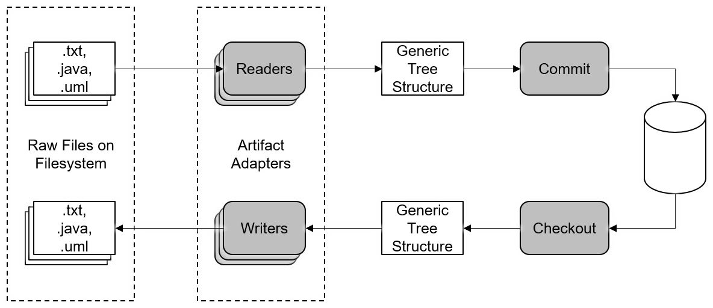
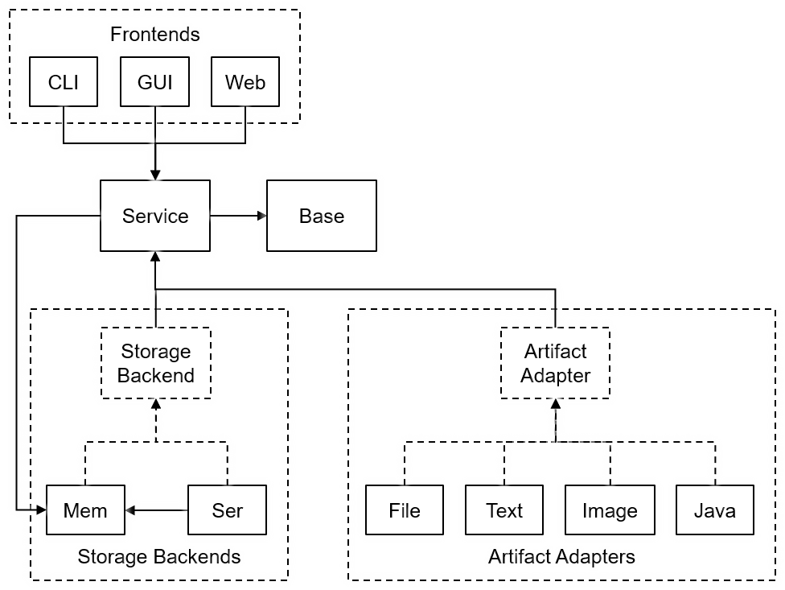

# ECCO

## Content

* [About](#about)
* [Data Structures](#data-structures)
* [Operations](#operations)
    * [Local Operations](#local-operations)
    * [Distributed Operations](#distributed-operations)
* [Directories and Files](#directories-and-files)
    * [Repository Directory](#repository-directory)
    * [Base Directory](#base-directory)
* [Artifact Types](#artifact-types)
* [Use Cases](#use-cases)
* [Quick Start](#quick-start)
* [IDEs](#ides)
    * [IntelliJ](#intellij)
    * [Eclipse](#eclipse)
* [Project Structure](#project-structure)
    * [Core Projects](#core-projects)
    * [Application Projects](#application-projects)
    * [Plugin Projects](#plugin-projects)
    * [Examples](#examples)
* [Publications](#publications)
    * [Peer-Reviewed Journals](#peer-reviewed-journals)
    * [Peer-Reviewed Conferences](#peer-reviewed-conferences)
    * [Peer-Reviewed Workshops](#peer-reviewed-workshops)

## About

*ECCO* is a *feature-oriented and distributed configuration management and version control system*.

It supports variability in (i.e., the configuration of) any type of artifact (e.g., text, images, code) for which an [adapter][adapter] is available.

Originally, the name *ECCO* was an acronym for *Extraction and Composition for Clone-and-Own*.

## Data Structures

A *repository* contains *features*, *revisions*, *artifacts*, and *traces* (i.e., mappings between features, revisions, and artifacts).

## Operations

ECCO supports *local operations* as well as *distributed operations*.

### Local Operations
* `init`
* `commit <full configuration>`
* `checkout <full configuration>`

### Distributed Operations
* `clone <partial configuration>`
* `push <partial configuration>`
* `pull <partial configuration>`

## Directories and Files

### Repository Directory

The directory in which the repository contents are stored. By default named `.ecco`.
It contains files used by the storage backend to persist the repository contents.
Its contents depend on the used storage backend and should not be modified manually, except the following two files which are not specific to the used storage backend, are created by the `init` operation and can be modified manually.

* `.ignores` contains glob file patterns of files that should be ignored by the `commit` operation.
* `.adapters` contains pairs of glob file patterns and identifiers of artifact adapter that should be used for the matched files. The initial contents of the file are created based on the default patterns of each installed artifact adapter during the `init` operation.

### Base Directory

The directory in which the raw implementation artifacts (files) of a variant reside. Also sometimes called *working directory*.
The contents of this directory are processed by the *readers* of the respective *artifact adapters* during a `commit` and created by the *writers* of the respective *artifact adapters* during a `checkout`.
The contents in this directory are created by the user and can be arbitrarily modified during development, except the following three files which are created by the `checkout` and `commit` operations.

* `.config` contains the *configuration* of the variant contained in the directory. This file is created during the `checkout` operation. It can also be created manually in which case it is used by the `commit` operation instead of having to pass the configuration as a parameter. If it exists its contents should always be updated to reflect the performed changes, specifically, the modified features should be marked as such.
* `.warnings` contains a list of feature interaction and uncertain ordering warnings or hints. This file is created by the `checkout` operation.
* `.hashes` contains the hashes of files that were created during the `checkout` operation. They are used by the `commit` operation to identify files that have not been modified.

## Artifact Types

## Use Cases
* *Feature Location*: Locating the implementation of features (i.e., computing traces) given a set of variants for each of which the configuration (i.e., features it provides) and implementation is known [[SPLC'19']][SPLC19].
* *Extractive Product Line Engineering*: Consolidating a set of individual variants into a common platform representation. In other words, reverse engineering a set of individual variants into a Software Product Line (SPL) [[SPLC'13]][SPLC13][[SoSyM'16]][SoSyM16].
* *Automated Reuse for Clone and Own*: Supporting ad hoc development of variants (clone and own) as well as their subsequent maintenance [[ICSME'14]][ICSME14].
* *Reactive/Incremental Product Line Engineering*: Supporting the evolution of a set of variants and their individual features [[SST'15]][SST15].
* *Distributed Version Control System*: Enabling feature-oriented distributed development with features as a core concept [[ICSE'16]][ICSE16ds].

## Quick Start

Get the code: `git clone` or download zip file into `<working_dir>`.

Requires:
* JDK 13
* (optional) [Gradle](http://gradle.org/ "Gradle") as build system. This is optional as a gradle-wrapper is included.

Run `gradle tasks` in `<working_dir>` for a list of supported tasks.

Examples:
* `gradle build` builds the projects.
* `gradle packageLinux` or `gradle packageWindows` creates binary distributions as zip file packages for every project. In case of projects that can be run (like CLI or GUI) the contents can be extracted and run.

## IDEs

### IntelliJ

IntelliJ supports Gradle out of the box. Just open the project using `File > Open`.

### Eclipse

*This information might be outdated!*

Eclipse does not support Gradle by default. There is a Gradle plugin for Eclipse, but I do not recommend it! Instead, follow these steps:

Create Eclipse projects from Gradle projects: `gradle eclipse`. This creates the `.project` and `.classpath` files Eclipse needs for every project.

Import the created Eclipse projects into your Eclipse workspace: `File > Import > General > Existing Projects Into Workspace`.
* Select root directory: `<working_dir>`
* Search for nested projects.
* Do *not* copy projects into workspace.

Select all shown projects and import them.

Disable errors for cyclic dependencies in Eclipse: `Window > Preferences > Java > Compiler > Building > Build path problems > Circular dependencies > Warning`.

## Project Structure

The root-project `ecco` consists of a number of sub-projects.

### Core Projects
* [`base`](base) contains the core data structures and algorithms.
* [`service`](service) contains the ECCO API and the plugin infrastructure for [artifact adapters][adapter] and [storage backends][storage].

### Application Projects
* [`cli`](cli) contains the CLI (Command Line Interface).
* [`gui`](gui) contains the GUI (Graphical User Interface).
* [`web`](web) contains the REST API.

### Plugin Projects
* [`adapter`][adapter] contains artifact adapter projects such as `file` (for binary or unknown files), `text`, `image`, or `java`.
* [`storage`][storage] contains storage backend projects.

[adapter]: adapter
[storage]: storage

### Examples
* [`examples`](examples) contains various illustrative examples to use as input to ECCO.

## Publications

### Peer-Reviewed Journals

[*Lukas Linsbauer, Roberto Erick Lopez-Herrejon, Alexander Egyed*: **Variability Extraction and Modeling for Product Variants**. Software and Systems Modeling (SoSyM), 2016, 1-21][SoSyM16]

[SoSyM16]: http://dx.doi.org/10.1007/s10270-015-0512-y

### Peer-Reviewed Conferences

[*Gabriela Karoline Michelon, Lukas Linsbauer, Wesley K. G. Assunção, Alexander Egyed*: **Comparison-Based Feature Location in ArgoUML Variants**. Systems and Software Product Line Conference (SPLC) Challenge Solutions, 2019, 93–97][SPLC19]

[SPLC19]: https://doi.org/10.1145/3336294.3342360

[*Lukas Linsbauer, Roberto Erick Lopez-Herrejon, Alexander Egyed*: **A Variability Aware Configuration Management and Revision Control Platform**. International Conference on Software Engineering (ICSE) Doctoral Symposium, 2016, 803-806][ICSE16ds]

[ICSE16ds]: http://doi.acm.org/10.1145/2889160.2889262

[*Stefan Fischer, Lukas Linsbauer, Roberto Erick Lopez-Herrejon, Alexander Egyed*: **Enhancing Clone-and-Own with Systematic Reuse for Developing Software Variants**. International Conference on Software Maintenance and Evolution (ICSME), 2014, 391-400][ICSME14]

[ICSME14]: http://dx.doi.org/10.1109/ICSME.2014.61

[*Lukas Linsbauer, Florian Angerer, Paul Grünbacher, Daniela Lettner, Herbert Prähofer, Roberto Erick Lopez-Herrejon, Alexander Egyed*: **Recovering Feature-to-Code Mappings in Mixed-Variability Software Systems**. International Conference on Software Maintenance and Evolution (ICSME), 2014, 426-430][ICSME14short]

[ICSME14short]: http://dx.doi.org/10.1109/ICSME.2014.67

[*Lukas Linsbauer, Roberto Erick Lopez-Herrejon, Alexander Egyed*: **Recovering Traceability between Features and Code in Product Variants**. Software Product Line Conference (SPLC), 2013, 131-140][SPLC13]

[SPLC13]: http://doi.acm.org/10.1145/2491627.2491630

### Peer-Reviewed Workshops

[*Lukas Linsbauer, Stefan Fischer, Roberto Erick Lopez-Herrejon, Alexander Egyed*: **Using Traceability for Incremental Construction and Evolution of Software Product Portfolios**. Software and Systems Traceability (SST), 2015, 57-60][SST15]

[SST15]: http://dx.doi.org/10.1109/SST.2015.16

