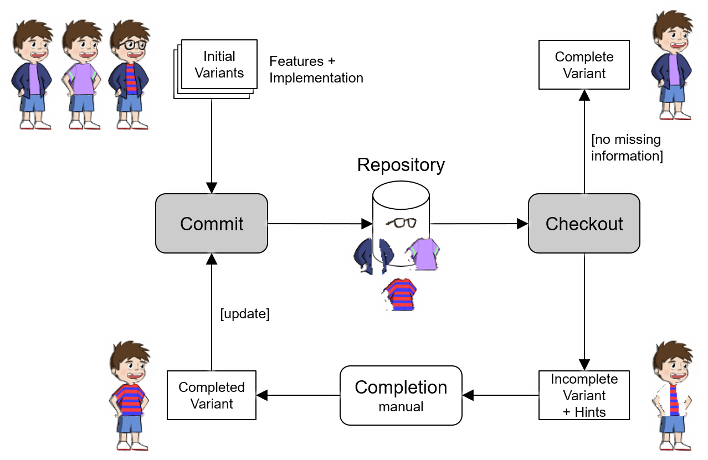
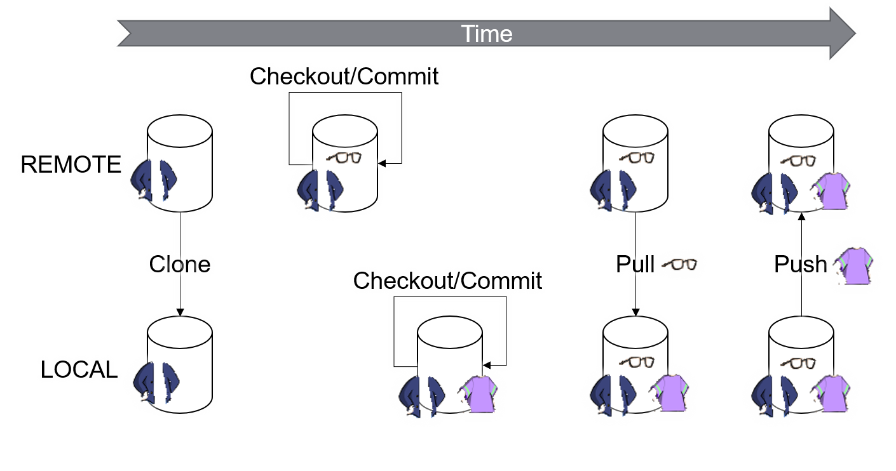
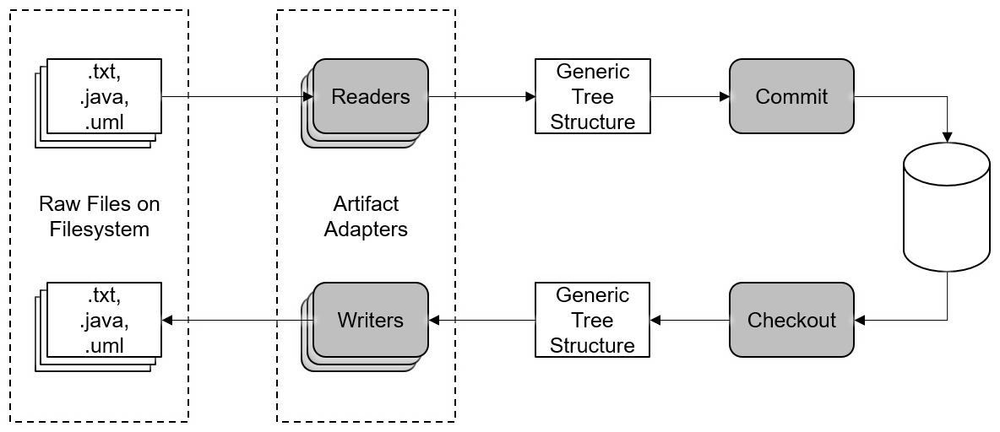

# ECCO

*ECCO* is a *feature-oriented and distributed configuration management and version control system*.
It manages variants of a system - any set of files, e.g. code, text, images, or music - together with the *features* each variant provides, and learns from them which artifacts implement which features.
From that, it can compose new variants for feature combinations that were never committed as such.

Originally, the name *ECCO* was an acronym for *Extraction and Composition for Clone-and-Own*.


## Contents

* [Concepts](#concepts)
* [Getting Started](#getting-started)
* [Command Line Interface](#command-line-interface)
* [Graphical User Interface](#graphical-user-interface)
* [Distributed Operations](#distributed-operations)
* [REST API](#rest-api)
* [Repository and Working Directory](#repository-and-working-directory)
* [Artifact Adapters](#artifact-adapters)
* [Project Structure](#project-structure)
* [Development](#development)
* [Use Cases](#use-cases)
* [Publications](#publications)


## Concepts

A *repository* contains *features*, their *revisions*, *artifacts*, and *traces* (mappings between features, revisions, and artifacts).

* A **variant** is a set of files - the *working directory* - together with its **configuration**: the features (feature revisions) it implements.
* **Commit** reads a variant with the [artifact adapters](#artifact-adapters) into artifact trees and merges them into the repository. Artifacts are grouped into **associations**: sets of artifacts that always occurred together. From the configurations of the commits an association occurred in, ECCO derives its **presence condition** - the features and feature interactions that trace to it.
* **Checkout** composes a variant for a configuration: it selects the associations whose conditions hold, orders the artifacts, and writes the files. Artifacts whose order was ambiguous, features that were never seen together, and artifacts that are present but not explained by the configuration are reported as *warnings*.



### Configurations

A configuration is a comma-separated list of feature revisions, e.g. `Base, Audio, Video.3f2a9c1`:

| Syntax | Meaning |
| --- | --- |
| `A` | the latest revision of feature `A` (a new feature if there is none) |
| `A'` | a new revision of `A` |
| `A.<revision>` | a specific revision of `A` - the full id, or a unique prefix such as the 7 characters ECCO displays |
| `[<feature id>]` | a feature by id instead of by name (for features with non-unique names) |

Committing with `A'` marks feature `A` as modified in that variant. A commit needs at least one feature: content committed without any could never be selected by a checkout, so ECCO refuses it - give the content every variant has a feature of its own (e.g. `BASE`) in every configuration.


## Getting Started

Requirements:

* JDK 21 or newer.
* Nothing else to build: the Gradle wrapper (`./gradlew`, Gradle 8.14) is included. The TypeScript adapter downloads its Node.js dependencies during the build.
* Optional, for some [artifact adapters](#artifact-adapters): Python 3 with the modules they need.

Build and test everything:

```
./gradlew build
```

Run the applications from the source tree, or install them as runnable distributions (`build/install/...` below each project):

| Application | Run | Install / package |
| --- | --- | --- |
| Command line interface | `./gradlew :ecco-cli:run --args="..."` | `./gradlew :ecco-cli:installDist` (scripts in `cli/build/install/ecco/bin`) |
| Graphical user interface | `./gradlew :ecco-gui:run` | `./gradlew :ecco-gui:installDist`, or a native application: `./gradlew :ecco-gui:jpackageApp` (macOS, Linux), `:ecco-gui:jpackageAppWindows` (on Windows) |
| REST server | `./gradlew :ecco-rest:run` | `./gradlew :ecco-rest:installDist` |

`./gradlew :ecco-cli:distZip` (likewise for `gui` and `rest`) creates a zip of the distribution.

A first session on the command line - two variants, then a new combination of their features:

```
mkdir shop && cd shop
ecco init
# ... create the files of the first variant ...
ecco commit -c "Base, Cart" -m "shop with cart"
# ... change the files into the second variant ...
ecco commit -c "Base, Wishlist" -m "shop with wishlist"

mkdir ../both && cp -r .ecco ../both && cd ../both
ecco checkout -c "Base, Cart, Wishlist"    # composed from both commits; see .warnings
```


## Command Line Interface

`ecco` works on the repository in the current directory or the nearest parent directory containing a `.ecco` directory. That directory is the working directory: a command run in a subdirectory still commits or checks out the whole variant. `init` and `fork` create a repository in the current directory. `ecco <command> -h` describes each command.

| Command | Description |
| --- | --- |
| `init` | Creates a repository (`.ecco`) in the current directory. |
| `status` | Shows the repository's state. |
| `adapters` | Lists the installed artifact adapters and the file patterns mapped to them. |
| `commit -c <configuration> [-m <message>]` | Commits the working directory as a variant with the given configuration. |
| `checkout -c <configuration>` | Composes the variant for the configuration into the working directory. |
| `features [name]` | Lists the features and their revisions. |
| `traces [id]` | Lists the associations with their presence conditions. |
| `get <property>`, `set <property> <value>` | Reads or changes a repository setting. |
| `remotes [--add NAME ADDRESS] [--remove NAME]` | Lists, adds, or removes remotes. |
| `fork [--exclude <revisions>] <remote>` | Creates a repository here from another one - see [Distributed Operations](#distributed-operations). |
| `fetch [remote]`, `pull [--exclude <revisions>] [remote]`, `push [--exclude <revisions>] [remote]` | Synchronize with a remote. |
| `dg` | Prints the dependency graph between associations. |
| `suggest-constraints [--min-witness N]` | Mines feature constraints (requires, excludes, ...) from the committed configurations. |
| `minimize-preview [--min-witness N]` | Shows the presence conditions simplified with the mined constraints (read-only). |

The exit code is 0 on success, 1 if a command fails, and 2 for invalid arguments.

The command line distribution includes the same [artifact adapters](#artifact-adapters) as the GUI (without their viewers), so it can work on repositories created with the GUI.


## Graphical User Interface

The GUI (`./gradlew :ecco-gui:run`) organizes its functions in a ribbon:

* **Repositories**: create, open, fork (see [Distributed Operations](#distributed-operations)), and close repositories.
* **Versions**: commit a variant or several variant folders at once, check out configurations, manage named *variants*, open a working directory, and **import a Git history** commit by commit - with feature suggestions for each commit from an optional LLM (any OpenAI-compatible chat completions endpoint, e.g. a local Ollama; set up under Preferences).
* **Collaborate**: remotes, fetch, pull, push, and a server other ECCO instances can sync with.
* **View**: features (with the feature model derived from the commits and mined constraints to accept or reject), commits (including a comparison of two commits), associations with their presence conditions (and simplified conditions), the artifact tree of any selection of associations, and charts.
* **Visualize**: a knowledge graph of features, commits, variants, and associations; the artifact graph; the dependency graph.

Wherever associations are listed, an *association preview* shows the artifacts of an association in their files, colored by association - for text, markdown, Java, C, LilyPond, TypeScript, Python, JSON, Jupyter notebooks, and images.

Checkouts show their warnings in the GUI: missing feature interactions, surplus artifacts, and ambiguous orders, which can be resolved by reordering and committing.


## Distributed Operations

Repositories exchange features, not whole histories: every distributed operation can exclude feature revisions.

* `fork <remote>` creates a new repository from another one, e.g. `ecco fork --exclude "Video.3f2a9c1" ../shop`.
* `fetch` reads a remote's features; `pull` and `push` merge a remote's repository into this one, or this one into the remote's.



A *remote* is either a local path - the repository's directory or its `.ecco` directory - or `host:port` of an ECCO server. The server is started from the GUI (Collaborate); it only accepts connections from the local machine unless it is started for all network interfaces. Remote synchronization is not authenticated, so only serve repositories on networks you trust.


## REST API

[`rest`](rest) is a REST server (Micronaut) for web clients, e.g. [ecco-client](https://github.com/MatthiasPreuner/ecco-client.git). It serves the repositories in a configurable storage directory on port 8081 (`PORT` environment variable) with an OpenAPI description and Swagger UI - see its [README](rest/README.md). Its user management is a demonstration setup (fixed users, default JWT secret): configure it before exposing the server.


## Repository and Working Directory

### Repository directory (`.ecco`)

Holds the repository. Everything in it is managed by ECCO except two files, which `init` creates and which may be edited:

* `.ignores`: glob patterns of files that `commit` ignores.
* `.adapters`: pairs of a glob pattern and the id of the artifact adapter used for matching files; the first matching line wins. `init` fills it with the default patterns of the adapters installed at that time, higher-priority adapters first. A mapped adapter that is not available fails the commit rather than silently reading the files with a different adapter.

The rest is the storage: a core file (`<id>.ser.zip`, current one named by the file `id`), one file per association in `associations/`, and one file per artifact in `artifacts/`. Commits are atomic: a crash during a commit leaves the previous state or the new one. The storage format evolves: repositories written by a newer ECCO cannot always be opened by an older one, and repositories from before the per-association storage format are rejected with an explanation.

### Working directory

Holds the files of one variant. `commit` reads it with the artifact adapters; `checkout` writes into it. ECCO maintains three files there:

* `.config`: the configuration of the checked-out variant. A commit without a configuration (in the GUI; the command line always takes `-c`) uses it; update it (mark modified features with `'`) when changing the variant.
* `.warnings`: the warnings of the last checkout - feature interactions that were never committed, surplus artifacts, and ambiguous orders, each with a suggested fix.
* `.hashes`: hashes of the checked-out files, used by `commit` to recognize unchanged files.


## Artifact Adapters

An adapter reads files of one kind into artifact trees and writes them back. The finer its trees, the more precisely features are traced (e.g. a statement instead of a line). The default file patterns (`.adapters` of a new repository; where two adapters claim a pattern, the one listed first gets the files):

| Adapter | Files | Granularity and notes |
| --- | --- | --- |
| Text | `*.txt`, `*.xml`, `*.html`, `*.css`, `*.js`, `*.java` | lines; keeps the encoding, line separators, and final newline |
| Markdown | `*.md`, `*.markdown` | markdown blocks |
| Java (AST) | `*.java` | Java syntax tree (before the text adapter's `*.java`) |
| C | `*.c`, `*.h` | lines, grouped by function; keeps the encoding, line separators, and final newline. Preprocessor directives are ordinary lines; VEVOS presence conditions (`pcs.variant.csv`) become proactive feature traces; a trace that contradicts the commit history is not used and is reported as a `TRACE` warning |
| C++ | `*.cpp`, `*.hpp` (and `*.c`, `*.h` after the C adapter) | lines, grouped by namespace, class, enum and function; like the C adapter otherwise. Repositories committed with its first version (which reordered files and dropped comments, namespaces, classes and `#if` directives) can be checked out but not committed to |
| TypeScript | `*.ts` | statements and blocks; parsed with the TypeScript compiler running in an embedded Node.js (Javet) |
| Python | `*.py`, `*.ipynb`, `*.json` | Python syntax tree (libcst), notebook cells, JSON values. **Needs `python` 3 with the modules `libcst` and `py4j` on the `PATH`** |
| LilyPond | `*.ly`, `*.ily` | LilyPond tokens. **Needs `python` 3 with the module `parce`**; rendering scores in the GUI needs LilyPond (see [its README](adapter/lilypond/README.md)) |
| Image | `*.png`, `*.jpg`, `*.jpeg`, `*.bmp`, `*.gif` | pixels |
| File | everything else | whole files (binary) |

Further adapters are included but not mapped by default: `golang`, `java` (line-based Java), `runtime`, and `challenge` (for the SPLC feature location challenge). Map files to them in `.adapters`. `java` and `challenge` only read files: a checkout of files committed with them fails. See [adapter](adapter) for how adapters are built.




## Project Structure

| Project | Content |
| --- | --- |
| [`base`](base) | Core data structures and algorithms: artifact trees, associations, modules and conditions, partial order graphs, composition. |
| [`service`](service) | The ECCO API (`EccoService`), the file-based storage, remote synchronization, adapter infrastructure, constraint mining and condition minimization. |
| [`logic`](logic), [`util`](util) | Propositional logic (LogicNG) and shared utilities. |
| [`cli`](cli), [`gui`](gui), [`rest`](rest) | The applications. |
| [`adapter`](adapter) | The artifact adapters. |
| [`extras/ly`](extras/ly) | A utility that fills a repository from numbered variant directories (used for the LilyPond experiments). |
| [`examples`](examples) | Example variants to commit, e.g. C, LilyPond, markdown, image, and TypeScript variants. |
| [`storage`](storage), `adapter/java6`, `adapter/java8`, `adapter/designspace`, other `extras` | Earlier storage backends and adapters, not part of the build. |

The architecture is drawn in [`doc/ecco-architecture.drawio`](doc/ecco-architecture.drawio) (open it with [diagrams.net](https://app.diagrams.net)). It is generated: change [`doc/gen_architecture_drawio.py`](doc/gen_architecture_drawio.py) and run `python3 doc/gen_architecture_drawio.py`.


## Development

* Open the project in IntelliJ IDEA (`File > Open`), which imports the Gradle build.
* `./gradlew build` runs all tests. Tests that need Python with `libcst` (Python adapter) are skipped without it; the LilyPond tests need `parce`.
* Dependency versions are kept in [`gradle/libs.versions.toml`](gradle/libs.versions.toml).
* See [CONTRIBUTING.md](CONTRIBUTING.md) and [CHANGELOG.md](CHANGELOG.md).


## Use Cases

* *Feature Location*: Locating the implementation of features (i.e., computing traces) given a set of variants for each of which the configuration (i.e., features it provides) and implementation is known [[SPLC'19']][SPLC19].
* *Extractive Product Line Engineering*: Consolidating a set of individual variants into a common platform representation. In other words, reverse engineering a set of individual variants into a Software Product Line (SPL) [[SPLC'13]][SPLC13][[SoSyM'16]][SoSyM16].
* *Automated Reuse for Clone and Own*: Supporting ad hoc development of variants (clone and own) as well as their subsequent maintenance [[ICSME'14]][ICSME14].
* *Reactive/Incremental Product Line Engineering*: Supporting the evolution of a set of variants and their individual features [[SST'15]][SST15].
* *Distributed Version Control System*: Enabling feature-oriented distributed development with features as a core concept [[ICSE'16]][ICSE16ds].


## Publications

### Peer-Reviewed Journals

[*Lukas Linsbauer, Roberto Erick Lopez-Herrejon, Alexander Egyed*: **Variability Extraction and Modeling for Product Variants**. Software and Systems Modeling (SoSyM), 2016, 1-21][SoSyM16]

[SoSyM16]: http://dx.doi.org/10.1007/s10270-015-0512-y

### Peer-Reviewed Conferences

[*Gabriela Karoline Michelon, Lukas Linsbauer, Wesley K. G. Assunção, Alexander Egyed*: **Comparison-Based Feature Location in ArgoUML Variants**. Systems and Software Product Line Conference (SPLC) Challenge Solutions, 2019, 93–97][SPLC19]

[SPLC19]: https://doi.org/10.1145/3336294.3342360

[*Lukas Linsbauer, Roberto Erick Lopez-Herrejon, Alexander Egyed*: **A Variability Aware Configuration Management and Revision Control Platform**. International Conference on Software Engineering (ICSE) Doctoral Symposium, 2016, 803-806][ICSE16ds]

[ICSE16ds]: http://doi.acm.org/10.1145/2889160.2889262

[*Stefan Fischer, Lukas Linsbauer, Roberto Erick Lopez-Herrejon, Alexander Egyed*: **Enhancing Clone-and-Own with Systematic Reuse for Developing Software Variants**. International Conference on Software Maintenance and Evolution (ICSME), 2014, 391-400][ICSME14]

[ICSME14]: http://dx.doi.org/10.1109/ICSME.2014.61

[*Lukas Linsbauer, Florian Angerer, Paul Grünbacher, Daniela Lettner, Herbert Prähofer, Roberto Erick Lopez-Herrejon, Alexander Egyed*: **Recovering Feature-to-Code Mappings in Mixed-Variability Software Systems**. International Conference on Software Maintenance and Evolution (ICSME), 2014, 426-430][ICSME14short]

[ICSME14short]: http://dx.doi.org/10.1109/ICSME.2014.67

[*Lukas Linsbauer, Roberto Erick Lopez-Herrejon, Alexander Egyed*: **Recovering Traceability between Features and Code in Product Variants**. Software Product Line Conference (SPLC), 2013, 131-140][SPLC13]

[SPLC13]: http://doi.acm.org/10.1145/2491627.2491630

### Peer-Reviewed Workshops

[*Lukas Linsbauer, Stefan Fischer, Roberto Erick Lopez-Herrejon, Alexander Egyed*: **Using Traceability for Incremental Construction and Evolution of Software Product Portfolios**. Software and Systems Traceability (SST), 2015, 57-60][SST15]

[SST15]: http://dx.doi.org/10.1109/SST.2015.16

