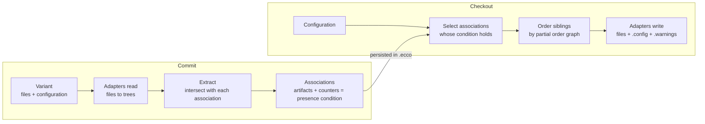

# ECCO - Recovered Requirements

As of 2026-10-02.

## Contents

* [Purpose, scope and method](#purpose-scope-and-method)
* [Stakeholders and usage contexts](#stakeholders-and-usage-contexts)
* [Domain model](#domain-model)
* [Functional requirements](#functional-requirements)
* [Artifact adapter requirements](#artifact-adapter-requirements)
* [Interface requirements](#interface-requirements)
* [Non-functional requirements](#non-functional-requirements)
* [Known gaps](#known-gaps)

## Purpose, scope and method

ECCO must let people manage a family of product variants as one repository: commit variants with the features they provide, learn which artifacts implement which features, and compose new variants for feature combinations never committed as such. The name stands for *Extraction and Composition for Clone-and-Own*.

These requirements were recovered, not written up front. ECCO has no requirements specification; it has about 1,400 commits since January 2016, a [README](../README.md), a [changelog](../CHANGELOG.md) that stops at 0.1.9, and the research papers listed in the README. Each requirement below names where it was recovered from:

* **Doc** - stated in the README or a module README.
* **Code** - enforced by the implementation (a check, a refusal, a guard).
* **Test** - asserted by an automated test, the strongest evidence of intent.
* **History** - introduced or fixed by a specific commit; the fix shows what the system was expected to do.

Scope: the live Gradle modules (`base`, `service`, `logic`, `util`, `cli`, `gui`, `rest` and the adapters in `settings.gradle`). The retired storage backends, the `java6`/`java8`/`designspace` adapters and other unbuilt extras are out of scope.

**shall** = required and enforced; **should** = expected but not enforced everywhere.

## Stakeholders and usage contexts

| Stakeholder | Goal | Front end | Evidence |
| --- | --- | --- | --- |
| Variant developer (clone-and-own) | Keep developing individual variants while reusing features across them | CLI, GUI | README Use Cases; ICSME'14 |
| Product-line engineer | Consolidate existing variants into a common platform; evolve features incrementally | GUI | SPLC'13, SoSyM'16, SST'15 |
| Feature-location researcher | Compute feature-to-artifact traces from known variants; run benchmarks (SPLC challenge, VEVOS) | CLI, `experiment`, challenge adapter | SPLC'19 |
| Distributed team | Exchange features, not whole histories, between repositories | CLI, GUI server | ICSE'16 doctoral symposium |
| Web-client user | Browse and operate repositories from a browser | REST + external [ecco-client](https://github.com/MatthiasPreuner/ecco-client.git) | `rest/README.md` |

The use cases they bring:

1. **Feature location** - given variants with known configurations, compute which artifacts implement which feature.
2. **Extractive product-line engineering** - reverse-engineer a set of variants into a platform.
3. **Automated reuse for clone-and-own** - compose a new variant from features of existing ones.
4. **Reactive/incremental product-line engineering** - evolve variants and individual features over time.
5. **Feature-oriented distributed version control** - fork, pull and push with features as the unit of exchange.

## Domain model

The names are the interfaces in `base` (package `at.jku.isse.ecco`).

| Term | Meaning | Code |
| --- | --- | --- |
| Feature | A named unit of functionality; identified by id, the name need not be unique | `feature.Feature` |
| Feature revision | One version of a feature; `A'` creates a new one | `feature.FeatureRevision` |
| Configuration | The set of feature revisions a variant provides, e.g. `Base, Audio, Video.3f2a9c1` | `feature.Configuration` |
| Variant | A working directory's files together with its configuration; can be named and stored | `core.Variant` |
| Commit | One recorded variant: configuration, message, and the associations it touched | `core.Commit` |
| Artifact | One element of an artifact tree (file, line, statement, pixel...) with adapter-specific data | `artifact.Artifact`, `ArtifactData` |
| Node / artifact tree | The tree an adapter reads from files; nodes hold artifacts | `tree.Node`, `RootNode` |
| Association | A set of artifacts that always occurred together across commits | `core.Association` |
| Module / module revision | A feature interaction: positive and negative features (revisions) that co-occurred | `module.Module`, `ModuleRevision` |
| Counter | How often each module revision was seen with an association; the source of its condition | `counter.AssociationCounter` |
| Presence condition | Disjunction of module revisions; holds in a configuration when one of them holds | `module.Condition` |
| Partial order graph | The known orderings of sibling artifacts; ambiguous where commits disagree | `pog.PartialOrderGraph` |
| Feature trace | A presence condition stated up front (e.g. from VEVOS), not learned | `featuretrace.FeatureTrace` |
| Constraint | A mined or accepted relation between features (requires, excludes...) | `core.Constraint` |
| Remote | Another repository, by local path or `host:port` | `core.Remote` |
| Repository | All of the above, stored in a `.ecco` directory | `repository.Repository` |

A commit never stores a variant whole: it splits the artifacts into associations, and a checkout reassembles any configuration whose associations' conditions hold.

## Functional requirements

Paths are abbreviated: `ES` = `service/.../service/EccoService.java`, `REPO` = `base/.../repository/Repository.java`, `DR`/`DW` = `service/.../adapter/dispatch/DispatchReader.java`/`DispatchWriter.java`, `STS` = `service/.../storage/ser/dao/SerTransactionStrategy.java`.

### Repository lifecycle

| ID | Requirement | Source |
| --- | --- | --- |
| FR-L1 | `init` shall create `.ecco` and refuse if the service is already initialized or the directory exists; defaults come from `ecco.properties` (max order 2, PROACTIVE evaluation, BOOST main tree, `ser` storage). | Code ES:870-895 |
| FR-L2 | A failed `init` or `fork` shall remove the half-created repository so the operation can be retried. | Test `FailedForkCleanupTest` |
| FR-L3 | `open` shall refuse a missing path, a non-directory or a directory without repository data, write nothing, and hint at a nested `.ecco`. | Test `OpenNonRepositoryTest`, `ForkFromWorkingDirectoryTest`; History 6ee3496e |
| FR-L4 | The service shall require exactly one storage plugin and at least one enabled artifact adapter. | Code ES:386-424 |
| FR-L5 | Every operation shall fail with "Service is not initialized" while no repository is open. | Code ES:375 |

### Configurations

| ID | Requirement | Source |
| --- | --- | --- |
| FR-F1 | A configuration shall be a comma-separated list of `A` (latest revision, or new feature), `A'` (new revision), `A.<rev>` (that revision) or `[<id>]` (feature by id); names are limited to `[a-zA-Z0-9_-]`. | Doc; Code `Configuration.java:27`, `ConfigurationParser` |
| FR-F2 | A revision id prefix of 7 or more characters shall resolve if unique. | Test `ShortRevisionIdTest`; History 1294d248 |
| FR-F3 | An ambiguous feature name shall be rejected with a hint to use the feature id. | Code `ConfigurationParser:175` |
| FR-F4 | Parsing a configuration shall not persist revisions as a side effect. | Test `ParseConfigurationPhantomRevisionTest` |
| FR-F5 | A configuration shall hold at most one revision per feature. | Code REPO:509-516 |
| FR-F6 | `[<id>]` shall name an existing feature, with the same meaning as its name in every form; an unknown id is rejected. | Test `UnknownFeatureIdTest` |

### Commit

| ID | Requirement | Source |
| --- | --- | --- |
| FR-M1 | A commit shall read the working directory through the adapters, extract its artifacts into associations, and update each association's counters (and so its presence condition). | Doc; Code `CommitService`, `Repository.extract` |
| FR-M2 | A commit without any feature shall be refused. | Code `CommitService:55`; History 26e445f1 |
| FR-M3 | Without an explicit configuration, a commit shall use `<working dir>/.config`, and fail if it exists but cannot be read. | Code `CommitService:118-128` |
| FR-M4 | Each previously unseen configuration shall be recorded as a variant. | Code `CommitService:70-95` |
| FR-M5 | Files matching `.ecco/.ignores` (defaults `.DS_Store`, `.gitignore`) shall be skipped; `.ecco`, `.config`, `.warnings` and `.hashes` are always skipped. | Code DR:31-39; Test `DsStoreIgnoredRegressionTest`, `GitignoreIgnoredRegressionTest` |
| FR-M6 | Files shall be routed by `.ecco/.adapters` (`pluginId;glob`, first match wins), written on first open from the adapters' priorities and fixed for the repository from then on. | Doc; Code DR:143-197 |
| FR-M7 | A file mapped to a disabled or missing adapter shall fail the commit, not fall back to another adapter; malformed `.adapters` lines are rejected. | Test `UnavailableAdapterRoutingTest` |
| FR-M8 | An unreadable file shall fail the commit, not be committed empty; symlink loops are skipped. | Test `UnreadableFileCommitTest`, `SymlinkLoopCommitTest` |
| FR-M9 | A commit or merge shall be refused into a repository holding artifacts in a retired adapter format; checkout still works. | Code REPO:1049-1090, `ArtifactData#retiredFormat` |
| FR-M10 | A commit shall run in one read-write transaction and roll back on any error; a listener failure never rolls back a committed transaction. | Code `CommitService:62-110`, `ListenerRegistry:76-82` |
| FR-M11 | Unchanged files should be recognized by the hashes in `.hashes` and not re-read. **Not met** - see [Known gaps](#known-gaps). | Doc vs Code DR:469-476 |

### Checkout and composition

| ID | Requirement | Source |
| --- | --- | --- |
| FR-K1 | A checkout shall select the associations whose presence condition holds for the configuration and prune the composed tree per node by the repository's evaluation strategy (RETROACTIVE, PROACTIVE, PROACTIVE-ADDITION, PROACTIVE-SUBTRACTION). | Code REPO:756-763, `CheckoutComposer`, `featuretrace/evaluation` |
| FR-K2 | Sibling order shall come from the partial order graph; a graph with cycles, redundant transitive edges or wrong node counts is rejected. | Code `DefaultOrderSelector`, `PartialOrderGraph:347-358` |
| FR-K3 | A checkout shall write into a working directory that is empty apart from `.ecco`, and refuse if `.config`, `.warnings` or `.hashes` exist. | Code DW:80-106, `CheckoutService:120-136` |
| FR-K4 | A checkout shall write `.config` (the configuration) and `.warnings`. | Doc; Code `CheckoutService:139-167` |
| FR-K5 | `.warnings` shall list, one per line with a suggested fix where one exists: MISSING feature interactions never committed, SURPLUS artifacts the configuration does not explain, ambiguous ORDER, UNRESOLVED associations, CONSTRAINT violations, and rejected TRACEs. | Code `CheckoutService:139-167`; Test `CheckoutMissingModuleDiagnosticsTest` |
| FR-K6 | MISSING warnings shall be trimmed: an interaction is not reported when a smaller sub-combination of it is already missing. | Code `ModuleRevisions.java:38-58` |
| FR-K7 | SURPLUS warnings shall be absorbed (X + XY = X) and suppressed when entailed by the accepted feature model; both on by default, a failure only logs, MISSING warnings are never suppressed. | Code `SurplusLatticeAbsorber`, `SurplusModuleSuppressor`; History ce32c243 |
| FR-K8 | Constraint-violation warnings shall be advisory and never block a commit or checkout. | Code ES:1196-1207 |
| FR-K9 | Composition shall run in a read-only transaction. | Test `ReadWithoutTransactionTest` |
| FR-K10 | Line-based files shall be written with the newest commit's encoding, line separator and final newline. | Test `TextFormatLastCommitWinsTest` |

### Constraints and condition minimization

| ID | Requirement | Source |
| --- | --- | --- |
| FR-N1 | The system shall mine MANDATORY, REQUIRES and EXCLUDES constraints from committed configurations, with a minimum witness count (>= 1, default 4) and a confidence threshold (0-1, default 0.9; 1.0 = hard rules only), sorted hard first, then by witnesses. | Code `ConstraintMiner:80-210` |
| FR-N2 | Mined constraints shall be suggestions only: never applied unless accepted. | Code `ConstraintMiner` |
| FR-N3 | Constraints shall be mined per feature, so revisions of one feature are never mutually exclusive. | Code `ConfigurationBridge` |
| FR-N4 | Accepted constraints shall be persisted and travel with fork, pull and push without duplication. | Test `ConstraintPersistenceMergeTest` |
| FR-N5 | An accepted constraint shall only be trusted while re-mining still yields it. | Test `AcceptedConstraintStaleReMineTest` |
| FR-N6 | Accepting or unaccepting many constraints shall be one transaction and one event. | Code `ConstraintService:84-122`; History d78d3cb0 |
| FR-N7 | Presence-condition minimization shall drop a literal or term only when SAT-proven equivalent under the accepted feature model; it is a preview and does not change checkout. | Code `PresenceConditionMinimizer`; Doc (`minimize-preview` is read-only) |

### Proactive feature traces

| ID | Requirement | Source |
| --- | --- | --- |
| FR-T1 | The C, C++ and challenge adapters shall read VEVOS presence conditions (`pcs.variant.csv`) as proactive feature traces, using feature names that match the configuration's. | Code `VevosConditionHandler`; History c2135755 |
| FR-T2 | A proactive trace shall hold in every commit containing its association and in no other; a contradicting trace is not used and is reported as a TRACE warning (too narrow / too broad) with the commit. | Code `ProactiveTraceCheck`; History cb7cf42e |

### Distributed operations

| ID | Requirement | Source |
| --- | --- | --- |
| FR-D1 | A remote shall be a local path (repository or its `.ecco`) or `host:port` (hostname, IPv4 or bracketed IPv6, port 1-65535); remote names are unique. | Test `RemoteAddressTest` |
| FR-D2 | `fork` shall create a new repository from a remote into an empty location and register it as `origin`. | Code ES:663-800 |
| FR-D3 | `fetch` shall read a remote's features; `pull` and `push` shall merge a remote into this repository or this one into the remote. | Doc |
| FR-D4 | `fork`, `pull` and `push` shall be able to exclude feature revisions: features left without revisions and modules containing excluded features are dropped, and an exclusion that leaves unresolved dependencies is refused. | Doc; Code REPO:867-1033 |
| FR-D5 | A fork or pull, reopened, shall check out the same content as the source. | History f9cce6ba, 8a4db407 |
| FR-D6 | The sync server shall refuse a second start, and accept only allow-listed classes when deserializing. | Test `RemoteSyncServerHardeningTest`; Code `SyncObjectStreams` |

### Git import

| ID | Requirement | Source |
| --- | --- | --- |
| FR-G1 | Git import shall read a local clone without touching its working tree or index, and apply commits oldest first along first parents. | Code `git/GitHistoryReader` |
| FR-G2 | Each Git commit's tree shall be extracted to an empty directory, skipping submodules and refusing entries outside it. | Code `GitHistoryReader` |
| FR-G3 | LLM suggestions shall be one request per commit (temperature 0, JSON output) judged against features already imported; a failure gives a blank suggestion, never an abort, and a suggestion is never committed without the import loop's decision. | Code `LlmFeatureSuggestionClient:398-410` |

## Artifact adapter requirements

An adapter reads files of one kind into artifact trees and writes them back. The finer its trees, the more precisely features are traced. Fidelity differs by adapter: line-based adapters are byte-exact, syntax-tree adapters are not.

### Contract for every adapter

| ID | Requirement | Source |
| --- | --- | --- |
| AD-1 | An adapter shall be a `ArtifactPlugin` registered through `ServiceLoader`, binding its reader, writer and optional viewers through Guice; `getPluginId()` returns the plugin class name. | Code; `adapter/README.md`; per-adapter plugin-id tests |
| AD-2 | A reader shall return one root node per file carrying `PluginArtifactData`; a writer is chosen by that plugin id. | Code DR, DW |
| AD-3 | A reader shall declare prioritized glob patterns; higher priority wins when `.adapters` is first written. | Code; Test `DispatchReaderJavaPluginPriorityTest` |
| AD-4 | Adapters shall be enabled or disabled per user; at least one must be enabled. | Code `AdapterPreferences`, ES |
| AD-5 | Viewers shall not be bound when running headless (`ecco.headless`). | Code; History 74517278 |
| AD-6 | Line-based adapters shall round-trip byte-exact: encoding (UTF-8, else ISO-8859-1), line separator and final newline. | Test `TextFileFormatTest` (5,000 random rounds) |
| AD-7 | An adapter whose tree format changes shall mark old data with `retiredFormat()` or a tree-format check, so old repositories are refused for commit, not corrupted. | Code `ArtifactData#retiredFormat`, `JavaASTData.TREE_FORMAT`, `cpp/data/RetiredFormat` |
| AD-8 | An adapter that needs Python shall fail the commit when Python or its modules are missing, not commit an empty file, and shall pick a free py4j port. | Test `PythonGatewayPortTest`, `LilypondGatewayPortTest` |

### Per adapter

| Adapter | Files | Granularity | Fidelity required | On by default | Evidence |
| --- | --- | --- | --- | --- | --- |
| File | everything else | whole file | byte-exact | yes | `FileReaderTest`, `FileWriterTest` |
| Text | `.txt .xml .html .css .js .java` | lines | byte-exact | yes | `TextReaderTest`, `TextFileWriterTest` |
| Markdown | `.md .markdown` | CommonMark/GFM blocks, nested by heading | byte-exact | yes | `MarkdownReaderTest`, `MarkdownFileWriterTest` |
| Image | `.png .jpg .jpeg .bmp .gif` | pixels | exact colours for PNG/BMP; JPEG lossy; never an empty file | yes | `ImageFormatWriteTest` |
| Java (AST) | `.java` | JavaParser AST, Java 18 level | every comment kept; braces, `synchronized`, arrow cases kept; layout pretty-printed, not byte-exact | yes | `JavaASTCommentTest`, `JavaASTStatementFidelityTest`, `JavaASTTreeFormatTest` |
| C | `.c .h` | lines grouped by function; `#if` as lines; VEVOS traces | byte-exact incl. blank lines, CRLF, Latin-1 | **no** | `CRoundTripTest` |
| C++ | `.cpp .hpp` (+ `.c .h`) | lines grouped by namespace, class, enum, function | byte-exact incl. include guards and comments; first format checkout-only | **no** | `CppRoundTripTest` |
| TypeScript | `.ts` | statements and blocks (TS compiler in embedded Node.js) | exact text incl. `;`, trailing comments, JSDoc; switch/enum order kept | yes | `TypeScriptRoundTripTest`, `TypeScriptOrderTest` |
| Python | `.py .ipynb .json` | libcst syntax tree; notebook cells; JSON values | not byte-exact: whitespace-only lines normalized, JSON re-indented, notebook outputs ignored | yes | `PythonAdapterTest` |
| LilyPond | `.ly .ily` | tokens (parce) | not byte-exact: tokens rejoined with spaces | yes | `LilypondVariantsCommitCheckoutTest` |
| Go | `.go` | tokens (ANTLR) | exact reconstruction | **no** | `GoWriterTest` |
| Runtime | `.runtime .java` | Java classes/methods/lines + btrace data | not format-preserving | **no** | `RuntimeWriterTest` |
| Java (lines) | `.java` | class, imports, members, statements | read-only: checkout refused | **no** | `JavaWriterTest` |
| Challenge | `.java` | class, method, line + VEVOS traces | read-only: checkout refused | **no** | `ChallengeReader*Test` |

## Interface requirements

Three front ends sit on one service API (`EccoService`): a CLI for scripting and experiments, a JavaFX GUI for exploration, and a REST server for the external web client. They do not offer the same operations; the matrix at the end shows where they differ.

### Command line (`cli`)

| ID | Requirement | Source |
| --- | --- | --- |
| IF-C1 | The CLI shall offer `init`, `status`, `adapters`, `commit -c [-m]`, `checkout -c`, `features`, `traces`, `get`/`set`, `remotes`, `fork`, `fetch`, `pull`, `push`, `dg`, `suggest-constraints` and `minimize-preview`. | Code `Main.registerCommands()` |
| IF-C2 | `commit` and `checkout` shall require a configuration (`-c`). | Code |
| IF-C3 | Exit codes shall be 0 on success, 1 on a failed command, 2 on invalid arguments; errors go to stderr with their cause chain, the stack trace only with `-Decco.debug=true`. | Code `Main.run` |
| IF-C4 | `fetch`, `pull` and `push` shall default to the remote `origin`; `pull`, `push` and `fork` take `--exclude` feature revisions. | Code |
| IF-C5 | `suggest-constraints` and `minimize-preview` shall take `--min-witness` (default 4) and `--confidence` (default 0.9); only hard (confidence 1.0) accepted constraints are ever applied. | Code |
| IF-C6 | `dg` shall print the association dependency graph as GML on stdout. | Code |
| IF-C7 | The CLI shall run without JavaFX and bundle the same adapters as the GUI, so it can work on repositories made with the GUI. | Code (`ecco.headless`, openjfx excluded); Doc |
| IF-C8 | The CLI shall find the repository in the current or nearest parent directory and use that directory as the working directory; `init` and `fork` create a repository in the current directory. | Doc; Test `MainRepositoryDiscoveryTest` |

### Graphical user interface (`gui`)

| ID | Requirement | Source |
| --- | --- | --- |
| IF-G1 | The GUI shall group its functions in a ribbon: Repositories (new, open, fork, close), Versions, Collaborate, View, Visualize; repository actions are disabled until a repository is open, and new, open and fork while one is. | Code `MainView`, `RibbonBar` |
| IF-G2 | Users shall be able to commit one variant folder or several at once, check out configurations, and manage named variants (add, remove, edit feature revisions, check out several into a base directory). | Code `CommitBaseDirView`, `CommitView`, `VariantsView` |
| IF-G3 | Users shall be able to import a Git history commit by commit, oldest first, with Import, Skip and Stop per reviewed commit, auto-importing the commits between every N-th review (N 1-1000, default 1). | Code `ImportGitView` |
| IF-G4 | Git import should suggest a configuration per commit from an LLM at any OpenAI-compatible endpoint, configured under Preferences (URL, model). | Code `PreferencesView`; Doc |
| IF-G5 | The feature model view shall show the feature model derived from the commits and let users accept, reject or return mined constraints, and minimize presence conditions with them. | Code `FeaturesView`, `ConstraintSuggestionsView` |
| IF-G6 | Users shall be able to list and compare commits, list associations with their full and simplified conditions, and browse the artifact tree of any selection of associations, then check out or compose that selection. | Code `CommitsView`, `CommitComparisonView`, `AssociationsView`, `ArtifactsView` |
| IF-G7 | Wherever associations are listed, an association preview shall show their artifacts in their files, coloured by association, for every mapped adapter. | Doc; Code `ArtifactDetailView` viewers |
| IF-G8 | Checkout results shall show their warnings with a suggested fix; an ambiguous order shall be resolvable by reordering in a dialog and committing. | Code `CheckoutDetailView`, `ReorderChildrenDialog` |
| IF-G9 | The GUI shall visualize a knowledge graph (features, commits, variants, associations), the artifact graph and the dependency graph, plus charts, each exportable. | Code `view/graph/*`, `ChartsView` |
| IF-G10 | The GUI shall manage remotes, fetch, pull and push, and start a sync server on a chosen port, local-only unless "accept connections from other machines" is set. | Code `RemotesView`, `ServerView` |
| IF-G11 | Users shall be able to enable or disable adapters (effective on the next open), and set minimization thresholds and LilyPond paths. | Code `PreferencesView` |

### REST server (`rest`)

| ID | Requirement | Source |
| --- | --- | --- |
| IF-R1 | The REST server shall serve the repositories of a storage directory to the external ecco-client on port 8081 (`PORT`), with an OpenAPI description and Swagger UI. | Doc; Code `application.yml` |
| IF-R2 | It shall let clients list, create, clone, fork (deselecting features) and delete repositories. | Code `RepositoryController` |
| IF-R3 | It shall accept a commit as a multipart upload of files, message, configuration and user name. | Code `CommitController` |
| IF-R4 | It shall let clients describe features and feature revisions, and pull features from another repository while deselecting some. | Code `FeatureController` |
| IF-R5 | It shall let clients manage variants (add, rename, add/update/remove features) and download a variant's checkout as a file. | Code `VariantController` |
| IF-R6 | Every endpoint except Swagger shall require an authenticated JWT bearer token. | Code `@Secured(IS_AUTHENTICATED)` |

### Where the front ends differ

| Operation | CLI | GUI | REST |
| --- | --- | --- | --- |
| Commit / checkout | yes | yes | commit upload / variant download |
| Named variants | no | yes | yes |
| Fork | yes | yes | yes |
| Fetch / pull / push | yes | yes | pull only, between its own repositories |
| Sync server | no | yes | no |
| Constraint mining | suggest + preview | suggest, accept, minimize | no |
| Git import | no | yes | no |
| Visualizations | `dg` as GML | yes | no |

## Non-functional requirements

None of these were written as targets; they are recovered from refusals in the code and from fixes that treated a behaviour as a defect. The baselines are measurements recorded with those fixes, not promises.

### Reliability and data integrity

| ID | Requirement | Source |
| --- | --- | --- |
| NFR-R1 | A commit shall be atomic: a crash leaves the previous state or the new one, never a mix. Dirty files are staged and rolled forward after the id swap. | Doc; History dc038fdc, 0bc9d570 |
| NFR-R2 | Durability shall not rely on per-file fsync; atomicity comes from the roll-forward journal. | History: fsync measured ~10x slower (112 s vs 10.6 s, 21k artifacts) and rejected |
| NFR-R3 | A commit followed by close, reopen and checkout shall reproduce exactly what was committed, for repositories, forks and pulls alike. | Test `CommitCheckoutTest`; History f9cce6ba, 8a4db407 |
| NFR-R4 | Distinct artifacts with equal content shall stay distinct through persistence. | History c288ed2d, da14de14 |
| NFR-R5 | Errors shall surface, not be dropped: missing associations throw instead of being skipped; a rollback never follows a successful commit. | History b51026a9 |
| NFR-R6 | Write-time pruning of associations shall not be used; it loses data on fork-and-merge. | History (reproduced, closed) |

### Performance (recorded baselines)

| ID | Requirement | Baseline | Source |
| --- | --- | --- | --- |
| NFR-P1 | Commit and checkout should scale to tens of features and variants interactively. | 60 variants / 40 features: commit 1.8 s, checkout 1.1 s, status 0.2 s | History 3b9b5827, 783828fb |
| NFR-P2 | Opening a repository should take seconds, not minutes. | Real x8 repo: 65 s to 5.3 s | History d61968a1 |
| NFR-P3 | A commit shall rewrite only what changed. | 15.7 s to 2.6 s after skipping identical writes | History 400a3db7 |
| NFR-P4 | Pixel-granular images should be usable at around 1.7 megapixels. | 71k-px image: commit 67 to 2 s, checkout 157 to 3.4 s | History d6d9006d, 5e4ec81a |
| NFR-P5 | Storage should stay compact as commits accumulate. | Association files 147 to 13 MB (compact counters); packs 2.5-7x smaller | History 783828fb, 69a47552 |

One performance risk is unbounded: partial-order-graph alignment is factorial in the number of concurrent unresolved branches.

### Concurrency

| ID | Requirement | Source |
| --- | --- | --- |
| NFR-C1 | Repository data shall be safe to read and write from background threads while the GUI reads it. | History 2dff68c2, b993d741, 22508fc3, d78d3cb0 |
| NFR-C2 | Listener events shall reach every listener even if one throws or events fire from a background thread. | History (CopyOnWriteArrayList, per-listener isolation) |
| NFR-C3 | The GUI shall keep repository writes off the JavaFX thread and UI reads on it. | History ba7aa9b4, f22586c1, b2d960e4 |

### Compatibility and evolution

| ID | Requirement | Source |
| --- | --- | --- |
| NFR-V1 | A repository in an older or retired format shall be refused with an explanation, never fail with an exception or be misread. | Code `ArtifactData#retiredFormat`, tree-format checks; History 925c956f |
| NFR-V2 | Where an adapter's tree format changed, old repositories should stay checkout-only rather than become unreadable. | History 9639e362 (C++) |
| NFR-V3 | Newer builds shall read older supported formats; older builds need not read newer ones. | Doc; History 783828fb, 69a47552 |

### Security

| ID | Requirement | Source |
| --- | --- | --- |
| NFR-S1 | The sync server shall accept only local connections unless explicitly started on all interfaces. | Doc |
| NFR-S2 | The REST server shall reject upload and repository names that escape their storage folder. | History d6082ea4 |
| NFR-S3 | Neither remote sync nor REST user management is production-grade: sync is unauthenticated, REST uses hard-coded demo users and a default JWT secret. | Doc - a stated limitation, not a met requirement |

### Platform and build

| ID | Requirement | Source |
| --- | --- | --- |
| NFR-B1 | The system shall build and test with JDK 21+ and the bundled Gradle wrapper, with no other prerequisite. | Doc |
| NFR-B2 | Tests that need optional Python modules (`libcst`, `parce`) shall be skipped, not failed, when the modules are absent. | Doc |
| NFR-B3 | CLI and REST shall run headless, without JavaFX on the classpath. | History 74517278 |
| NFR-B4 | The GUI shall be installable as a native application on macOS, Linux and Windows. | Doc (jpackage tasks) |
| NFR-B5 | Third-party dependency versions shall be kept in one version catalog. | Doc (`gradle/libs.versions.toml`) |

## Known gaps

Requirements the code does not meet, places where the documentation and the code disagree, and partial implementations. Ordered by how likely they are to surprise a user.

| # | Gap | Where | Kind |
| --- | --- | --- | --- |
| 1 | The README maps `*.c`/`*.h`/`*.cpp`/`*.hpp` to the C and C++ adapters by default, but both are disabled by default, so those files go to the File adapter (whole-file granularity, no VEVOS traces) unless enabled in Preferences. | `AdapterPreferences.DEFAULT_DISABLED_PLUGIN_IDS` vs README | Doc/code mismatch |
| 2 | The CLI only works from the repository root: it fixes the repository at `./.ecco`, though the README promises a search of parent directories (`EccoService.detectRepository` exists but is not used). | `cli/.../Main.java:41` (IF-C8) | Doc/code mismatch - **fixed 2026-10-03**: commands search upwards; the repository's directory, not the current one, is the working directory (README corrected) |
| 3 | `.hashes` is written on checkout but never used: the unchanged-file check is commented out, so every commit re-reads every file. | DR:469-476 (FR-M11) | Partial |
| 4 | The `java` (lines) and `challenge` adapters have no writer: a checkout of their files writes nothing. Both are off by default. | `JavaWriter.java:30` in both adapters | Partial - **fixed 2026-10-02**: both writers now refuse with a message naming the Java (AST) adapter; documented as read-only |
| 5 | Several adapters claim `.java` (java-ast, java, challenge, runtime) and `.c`/`.h` (C, C++) at the same priority; if more than one is enabled, which one wins depends on set order. | adapter patterns | Ambiguous requirement |
| 6 | Condition minimization is preview-only; it is not applied to checkout. | `minimize-preview`; FR-N7 | Not implemented (by choice so far) |
| 7 | Partial-order-graph alignment is factorial in concurrent unresolved branches; no bound is enforced beyond a capped fallback. | `PartialOrderGraph` | Performance risk |
| 8 | Remote sync is unauthenticated; the REST server has hard-coded demo users with plaintext passwords and a default JWT secret, and its roles are never checked. | README; `rest/.../DummyUserDB`, `application.yml` | Security limitation |
| 9 | The REST storage directory is not configurable; it is chosen by heuristics (Docker, a `jenkins` user, else `examples/`). | `rest/.../Settings` | Missing configuration |
| 10 | Java 21 pattern-matching `switch` and record patterns are not supported by the Java (AST) adapter and fail loudly; comments inside lambdas and expressions are unverified. | `JavaASTReader` | Partial |
| 11 | Non-lazy composition throws "not yet implemented". | REPO:831 | Not implemented (unused) - **fixed 2026-10-02**: the unused option and its branch removed |
| 12 | Unknown `[<id>]` features in a configuration silently create a temporary feature (the strict check is commented out). | `ConfigurationParser:160` | Weak validation - **fixed 2026-10-02**: unknown ids are rejected; fixing it also showed that `[<id>]` and `[<id>].<rev>` of an *existing* feature resolved to a new revision instead of the latest or the given one, fixed too |
| 13 | A local fork opens its origin read-write (TODO "init read only!"). | ES:756 | Partial |
| 14 | GUI leftovers: `ForkView` unused (no Fork in the GUI), `FeatureDetailView` and `PresenceConditionDetailView` unreferenced, several `ArtifactsView` toggles marked TODO. | `gui/...` | Dead / unfinished UI - **fixed 2026-10-03**: Fork is on the Repositories ribbon (rewritten on `EccoService.fork`, test `ForkViewTest`); the dead views and placeholder toggles removed |
| 15 | `lilypond-config.properties` contains a hard-coded per-user path. | `adapter/lilypond/src/main/resources` | Portability - **fixed 2026-10-02**: bundled defaults empty, `lilypond` looked up on the PATH |
| 16 | `AdapterPreferences.java` holds a raw NUL character in a string literal, so git treats the file as binary and hides its diffs. | `service/.../AdapterPreferences.java:22` | Hygiene - **fixed 2026-10-02** |
| 17 | The changelog stops at 0.1.9 and no requirements or release notes record the work since; this document is the only consolidated statement of intent. | `CHANGELOG.md` | Documentation |
