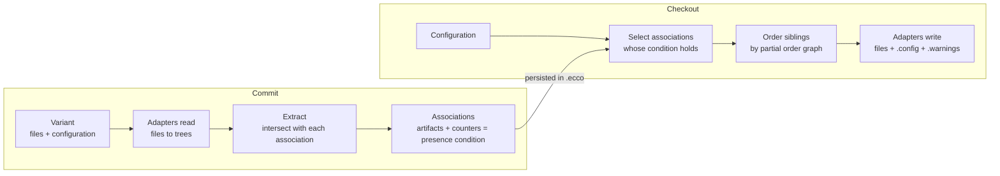

# ECCO - Recovered Requirements

As of 2026-10-03.

## Contents

* [Purpose, scope and method](#purpose-scope-and-method)
* [Stakeholders and usage contexts](#stakeholders-and-usage-contexts)
* [Domain model](#domain-model)
* [Use cases](#use-cases)
* [Functional requirements](#functional-requirements)
* [Artifact adapter requirements](#artifact-adapter-requirements)
* [Interface requirements](#interface-requirements)
* [Non-functional requirements](#non-functional-requirements)
* [Known gaps](#known-gaps)

## Purpose, scope and method

ECCO must let people manage a family of product variants as one repository: commit variants with the features they provide, learn which artifacts implement which features, and compose new variants for feature combinations never committed as such. The name stands for *Extraction and Composition for Clone-and-Own*.

These requirements were recovered, not written up front. ECCO has no requirements specification; it has about 1,400 commits since January 2016, a [README](../README.md), a [changelog](../CHANGELOG.md) that stops at 0.1.9, and the research papers listed in the README. Each requirement below names where it was recovered from:

* **Doc** - stated in the README or a module README.
* **Code** - enforced by the implementation (a check, a refusal, a guard).
* **Test** - asserted by an automated test, the strongest evidence of intent.
* **History** - introduced or fixed by a specific commit; the fix shows what the system was expected to do.

Scope: the live Gradle modules (`base`, `service`, `logic`, `util`, `cli`, `gui`, `rest` and the adapters in `settings.gradle`). The retired storage backends, the `java6`/`java8`/`designspace` adapters and other unbuilt extras are out of scope.

**shall** = required and enforced; **should** = expected but not enforced everywhere.

## Stakeholders and usage contexts

| Stakeholder | Goal | Front end | Evidence |
| --- | --- | --- | --- |
| Variant developer (clone-and-own) | Keep developing individual variants while reusing features across them | CLI, GUI | README Use Cases; ICSME'14 |
| Product-line engineer | Consolidate existing variants into a common platform; evolve features incrementally | GUI | SPLC'13, SoSyM'16, SST'15 |
| Feature-location researcher | Compute feature-to-artifact traces from known variants; run benchmarks (SPLC challenge, VEVOS) | CLI, `experiment`, challenge adapter | SPLC'19 |
| Distributed team | Exchange features, not whole histories, between repositories | CLI, GUI server | ICSE'16 doctoral symposium |
| Web-client user | Browse and operate repositories from a browser | REST + external [ecco-client](https://github.com/MatthiasPreuner/ecco-client.git) | `rest/README.md` |

The use cases they bring:

1. **Feature location** - given variants with known configurations, compute which artifacts implement which feature.
2. **Extractive product-line engineering** - reverse-engineer a set of variants into a platform.
3. **Automated reuse for clone-and-own** - compose a new variant from features of existing ones.
4. **Reactive/incremental product-line engineering** - evolve variants and individual features over time.
5. **Feature-oriented distributed version control** - fork, pull and push with features as the unit of exchange.

[Use cases](#use-cases) details them as step-by-step scenarios.

## Domain model

The names are the interfaces in `base` (package `at.jku.isse.ecco`).

| Term | Meaning | Code |
| --- | --- | --- |
| Feature | A named unit of functionality; identified by id, the name need not be unique | `feature.Feature` |
| Feature revision | One version of a feature; `A'` creates a new one | `feature.FeatureRevision` |
| Configuration | The set of feature revisions a variant provides, e.g. `Base, Audio, Video.3f2a9c1` | `feature.Configuration` |
| Variant | A working directory's files together with its configuration; can be named and stored | `core.Variant` |
| Commit | One recorded variant: configuration, message, and the associations it touched | `core.Commit` |
| Artifact | One element of an artifact tree (file, line, statement, pixel...) with adapter-specific data | `artifact.Artifact`, `ArtifactData` |
| Node / artifact tree | The tree an adapter reads from files; nodes hold artifacts | `tree.Node`, `RootNode` |
| Association | A set of artifacts that always occurred together across commits | `core.Association` |
| Module / module revision | A feature interaction: positive and negative features (revisions) that co-occurred | `module.Module`, `ModuleRevision` |
| Counter | How often each module revision was seen with an association; the source of its condition | `counter.AssociationCounter` |
| Presence condition | Disjunction of module revisions; holds in a configuration when one of them holds | `module.Condition` |
| Partial order graph | The known orderings of sibling artifacts; ambiguous where commits disagree | `pog.PartialOrderGraph` |
| Feature trace | A presence condition stated up front (e.g. from VEVOS), not learned | `featuretrace.FeatureTrace` |
| Constraint | A mined or accepted relation between features (requires, excludes...) | `core.Constraint` |
| Remote | Another repository, by local path or `host:port` | `core.Remote` |
| Repository | All of the above, stored in a `.ecco` directory | `repository.Repository` |

A commit never stores a variant whole: it splits the artifacts into associations, and a checkout reassembles any configuration whose associations' conditions hold.

## Use cases

The use cases describe the key usage scenarios step by step, with their normal course and their alternatives. They follow RUCM (Restricted Use Case Modeling, Yue, Briand and Labiche, 2009). They are a complement to the requirements: the requirements say what must hold, the use cases say in which order actor and system interact. Each use case names the requirements it realizes.

**Template.** Each use case has a name, a brief description, a precondition, a primary actor, secondary actors, dependencies (INCLUDE USE CASE, EXTENDED BY USE CASE) and generalizations. After these come one basic flow and any number of alternative flows, and each flow ends with a postcondition. RUCM has three kinds of alternative flow:

* A **specific** flow (`RFS n`) branches at one step of the basic flow.
* A **bounded** flow (`RFS n-m`) can start at any of the steps n to m.
* A **global** flow can start at any step.

An alternative flow ends with `ABORT` (the use case ends) or `RESUME STEP n` (the flow continues at step n). This document adds two rows to the template: the front ends that offer the use case and the requirements it realizes.

**Restrictions applied.**

* Each step is one sentence in the simple present and the active voice, with the actor or the system as its subject.
* Steps use no modal verbs and no pronouns.
* There are four kinds of step: the actor requests, the system validates, the system acts internally, and the system replies.
* Conditions and loops use the RUCM keywords: `VALIDATES THAT`, `IF ... THEN ... ELSE ... ENDIF`, `DO ... UNTIL`, `MEANWHILE`.
* The system is written as "the system" whatever the front end.
* Messages in quotes are the system's actual texts.

### Actors

| Actor | Kind | Stakeholder (see above) |
| --- | --- | --- |
| Variant developer | Primary | Variant developer (clone-and-own) |
| Product-line engineer | Primary | Product-line engineer |
| Researcher | Primary | Feature-location researcher |
| Collaborator | Primary | Distributed team |
| Web-client user | Primary | Web-client user, through the external ecco-client |
| Remote repository | Secondary | Another ECCO repository, at a local path or behind a sync server (`host:port`) |
| LLM service | Secondary | Any OpenAI-compatible endpoint configured under Preferences |
| Git clone | Secondary | A local Git repository whose history is imported |

### Overview

| ID | Use case | Primary actor | Front ends | Stakeholder use case |
| --- | --- | --- | --- | --- |
| UC-1 | Initialize repository | Variant developer | CLI, GUI | all |
| UC-2 | Open repository | Variant developer | CLI, GUI | all |
| UC-3 | Commit variant | Variant developer | CLI, GUI | 1-4 |
| UC-4 | Commit several variants | Variant developer | GUI | 1, 2 |
| UC-5 | Check out variant | Variant developer | CLI, GUI | 3, 4 |
| UC-6 | Resolve ambiguous order | Variant developer | GUI | 3, 4 |
| UC-7 | Locate features | Researcher | CLI, GUI | 1 |
| UC-8 | Review mined constraints | Product-line engineer | GUI (CLI read-only) | 2, 4 |
| UC-9 | Minimize presence conditions | Product-line engineer | CLI, GUI | 2 |
| UC-10 | Import Git history | Product-line engineer | GUI | 2, 4 |
| UC-11 | Fork repository | Collaborator | CLI, GUI, REST | 5 |
| UC-12 | Exchange features with a remote | Collaborator | CLI, GUI, REST (pull only) | 5 |
| UC-13 | Serve repository for synchronization | Collaborator | GUI | 5 |
| UC-14 | Commit through the web client | Web-client user | REST | 3 |
| UC-15 | Download variant through the web client | Web-client user | REST | 3 |

The stakeholder use cases are the five listed under [Stakeholders and usage contexts](#stakeholders-and-usage-contexts): 1 feature location, 2 extractive product-line engineering, 3 automated reuse for clone-and-own, 4 reactive product-line engineering, 5 feature-oriented distributed version control.

### UC-1 Initialize repository

| | |
| --- | --- |
| Brief description | The variant developer creates an empty repository for a directory. |
| Precondition | The session has no open repository. |
| Primary actor | Variant developer |
| Secondary actors | None |
| Dependency | None |
| Generalization | None |
| Front ends | CLI `init` (current directory); GUI Repositories > New |
| Realizes | FR-L1, FR-L2, FR-L4 |

**Basic flow**

1. The variant developer requests a new repository for a directory.
2. The system VALIDATES THAT the directory holds no repository.
3. The system creates the `.ecco` directory.
4. The system stores the defaults from `ecco.properties` in the repository.
5. The system opens the new repository.

Postcondition: An empty repository exists in `<directory>/.ecco` and is open.

**Specific alternative flow SA1** (RFS 2)

1. The system reports "Repository already exists at this location.".
2. ABORT.

Postcondition: The existing repository is unchanged.

**Bounded alternative flow BA1** (RFS 3-5)

1. IF the creation of the repository fails THEN the system removes the half-created repository ENDIF.
2. The system reports the error with its cause.
3. ABORT.

Postcondition: The directory holds no repository, and the variant developer can retry.

### UC-2 Open repository

| | |
| --- | --- |
| Brief description | The variant developer opens an existing repository, which every other use case except UC-1 and UC-11 needs. |
| Precondition | None |
| Primary actor | Variant developer |
| Secondary actors | None |
| Dependency | None |
| Generalization | None |
| Front ends | CLI (each command opens the repository itself); GUI Repositories > Open |
| Realizes | FR-L3, FR-L4, FR-L5, IF-C8, NFR-V1 |

**Basic flow**

1. The variant developer requests to open a directory.
2. The system VALIDATES THAT the directory exists and holds repository data.
3. The system VALIDATES THAT exactly one storage plugin and at least one enabled artifact adapter are available.
4. The system VALIDATES THAT the repository format is supported.
5. The system loads the repository.
6. The system enables the repository operations.

Postcondition: The repository is open, and the system has written nothing.

**Specific alternative flow SA1** (RFS 1)

1. IF the variant developer runs a CLI command THEN the system searches the current directory and its parents for the nearest `.ecco` ENDIF.
2. The system uses the directory that holds `.ecco` as the working directory.
3. RESUME STEP 2.

Postcondition: The repository directory is known.

**Specific alternative flow SA2** (RFS 2)

1. The system reports that the path holds no repository, with a hint at a nested `.ecco` where one exists.
2. ABORT.

Postcondition: The system has written nothing.

**Specific alternative flow SA3** (RFS 3)

1. The system reports the missing storage plugin or the missing enabled adapter.
2. ABORT.

Postcondition: The session has no open repository.

**Specific alternative flow SA4** (RFS 4)

1. The system reports the older or retired format with an explanation.
2. ABORT.

Postcondition: The repository is unchanged.

### UC-3 Commit variant

| | |
| --- | --- |
| Brief description | The variant developer records the files of a working directory as a variant with a configuration; the system splits the artifacts into associations and updates their presence conditions. |
| Precondition | A repository is open (UC-2). The working directory holds the variant's files. |
| Primary actor | Variant developer |
| Secondary actors | None |
| Dependency | Included by UC-4, UC-7, UC-10, UC-14 |
| Generalization | None |
| Front ends | CLI `commit -c <configuration> [-m <message>]` (prints the commit id and any violated constraints); GUI Versions > Commit |
| Realizes | FR-F1 to FR-F6, FR-M1 to FR-M10, FR-T1, IF-C9, NFR-R1, NFR-R3 |

**Basic flow**

1. The variant developer enters a configuration and a commit message for the working directory.
2. IF the configuration is empty THEN the system reads the configuration from `.config` in the working directory ENDIF.
3. The system VALIDATES THAT the configuration is well-formed and names at least one feature.
4. The system begins a read-write transaction.
5. The system reads every file that `.ecco/.ignores` does not exclude, with the adapter that `.ecco/.adapters` maps the file to.
6. The system VALIDATES THAT the repository holds no artifacts in a retired adapter format.
7. The system intersects the artifacts with every association.
8. The system updates the counters of every association that the commit touches.
9. IF the configuration is new THEN the system records the configuration as a variant ENDIF.
10. The system commits the transaction.
11. The system VALIDATES THAT the configuration satisfies the accepted constraints.
12. The system reports success.

Postcondition: The repository holds the commit, and the presence condition of every touched association reflects the configuration. A later checkout of the same configuration reproduces the files (NFR-R3).

**Specific alternative flow SA1** (RFS 3)

1. The system reports the configuration error: invalid syntax, an ambiguous feature name, an unknown feature id, or "A commit needs at least one feature: ... (e.g. BASE).".
2. ABORT.

Postcondition: The repository is unchanged.

**Specific alternative flow SA2** (RFS 6)

1. The system rolls back the transaction.
2. The system reports that the repository holds a retired adapter format and can only be checked out.
3. ABORT.

Postcondition: The repository is unchanged.

**Specific alternative flow SA3** (RFS 11)

1. The system reports each violated constraint as a warning.
2. RESUME STEP 12.

Postcondition: The commit is stored; the violation is advisory (FR-K8).

**Bounded alternative flow BA1** (RFS 4-10)

1. IF a file is unreadable, a file maps to a disabled or missing adapter, an adapter's Python modules are missing, or storing fails THEN the system rolls back the transaction ENDIF.
2. The system reports the error with its cause.
3. ABORT.

Postcondition: The repository is in its state before the commit (NFR-R1).

### UC-4 Commit several variants

| | |
| --- | --- |
| Brief description | The variant developer commits several variant folders of one parent folder in a chosen order, typically to consolidate existing clones into a repository. |
| Precondition | A repository is open (UC-2). Each variant folder holds one variant, usually with a `.config`. |
| Primary actor | Variant developer |
| Secondary actors | None |
| Dependency | INCLUDE USE CASE Commit variant |
| Generalization | None |
| Front ends | GUI Versions > Commit Multiple Versions |
| Realizes | IF-G2, FR-M3 |

**Basic flow**

1. The variant developer selects a parent folder.
2. The system VALIDATES THAT the parent folder has subfolders.
3. The variant developer selects the variant folders.
4. The system lists the selected folders with the configuration from each folder's `.config`.
5. The variant developer orders the folders and edits configurations and commit messages.
6. The system shows the constraint violations of each configuration.
7. The variant developer requests the commit.
8. The system VALIDATES THAT at least one folder is listed.
9. The system VALIDATES THAT no configuration violates an accepted constraint.
10. DO
11. INCLUDE USE CASE Commit variant for the next folder with the folder's configuration and message.
12. The system logs the folder and the commit time.
13. UNTIL every listed folder is committed.
14. The system shows the log and the last commit.

Postcondition: The repository holds one commit per listed folder, in the listed order.

**Specific alternative flow SA1** (RFS 2)

1. The system reports "The selected folder has no subfolders".
2. RESUME STEP 1.

Postcondition: The folder list is unchanged.

**Specific alternative flow SA2** (RFS 8)

1. The system reports "Add at least one folder to commit.".
2. RESUME STEP 1.

Postcondition: Nothing is committed.

**Specific alternative flow SA3** (RFS 9)

1. The system lists the violations and asks for confirmation.
2. IF the variant developer confirms THEN RESUME STEP 10 ELSE RESUME STEP 5 ENDIF.

Postcondition: Nothing is committed yet.

**Bounded alternative flow BA1** (RFS 11-12)

1. IF a commit fails THEN the system shows the error next to the log ENDIF.
2. ABORT.

Postcondition: The folders committed before the failure stay committed; the remaining folders are not committed.

### UC-5 Check out variant

| | |
| --- | --- |
| Brief description | The variant developer composes the variant for a configuration, which may be a feature combination never committed as such, and writes it into an empty working directory. |
| Precondition | A repository is open (UC-2) and holds at least one commit. |
| Primary actor | Variant developer |
| Secondary actors | None |
| Dependency | EXTENDED BY USE CASE Resolve ambiguous order; included by UC-15 |
| Generalization | None |
| Front ends | CLI `checkout -c <configuration> [--minimized]`; GUI Versions > Checkout, View > Variants, View > Artifacts (compose a selection) |
| Realizes | FR-K1 to FR-K10, FR-N9, FR-T2, AD-6, IF-C9 |

**Basic flow**

1. The variant developer enters a configuration for a working directory.
2. The system VALIDATES THAT the configuration is well-formed.
3. The system VALIDATES THAT the working directory is empty apart from `.ecco`.
4. The system begins a read-only transaction.
5. The system selects the associations whose presence condition holds for the configuration.
6. The system prunes the composed artifact tree by the repository's evaluation strategy.
7. The system orders sibling artifacts by the partial order graphs.
8. The system collects MISSING, SURPLUS, ORDER, UNRESOLVED, CONSTRAINT and TRACE warnings.
9. The system ends the transaction.
10. The system writes the files with the adapters.
11. The system writes `.config` and `.warnings` into the working directory.
12. The system shows the warnings with a suggested fix for each. EXTENDED BY USE CASE Resolve ambiguous order.

Postcondition: The working directory holds the composed variant, `.config` and `.warnings`; the repository is unchanged.

**Specific alternative flow SA1** (RFS 2)

1. The system reports the configuration error.
2. ABORT.

Postcondition: The working directory is unchanged.

**Specific alternative flow SA2** (RFS 3)

1. The system reports that the working directory is not empty or already holds `.config`, `.warnings` or `.hashes`.
2. ABORT.

Postcondition: The working directory is unchanged.

**Specific alternative flow SA3** (RFS 5)

1. IF the variant developer requested minimized conditions THEN the system selects with the stored minimized conditions that are still valid and with the full conditions for the other associations ENDIF.
2. RESUME STEP 6.

Postcondition: The selection equals the selection with full conditions for every configuration that the trusted constraints allow (FR-N9).

**Specific alternative flow SA4** (RFS 12)

1. IF the variant developer works with the CLI THEN the system prints the configuration and the number of warnings of each kind, with a pointer to `.warnings` ENDIF.
2. ABORT.

Postcondition: Same as the basic flow.

### UC-6 Resolve ambiguous order

| | |
| --- | --- |
| Brief description | After a checkout reports an ORDER warning, the variant developer chooses the order of an artifact's children, and the system records the order in the repository without a commit, so that later checkouts know the order. |
| Precondition | A checkout in the GUI (UC-5) reports an ORDER warning. |
| Primary actor | Variant developer |
| Secondary actors | None |
| Dependency | Extends UC-5 at step 12 |
| Generalization | None |
| Front ends | GUI checkout details; CLI `order <file>...` |
| Realizes | IF-G8, IF-C10, FR-K2, FR-K5, FR-K11 |

**Basic flow**

1. The variant developer selects the ORDER warning and requests a reorder.
2. The system shows the children of the artifact, with the pairs whose order earlier commits fixed shown as locked.
3. The system VALIDATES THAT at least one child can move.
4. The variant developer moves children into the intended order.
5. The variant developer confirms the order.
6. The system VALIDATES THAT the order agrees with every order recorded before.
7. The system records the order in the partial order graph of the artifact.
8. The system rewrites the file in the checkout directory in the new order.
9. The system shows the warnings without the resolved ORDER warning.

Postcondition: The repository records the chosen order, and later checkouts that contain these children use it, whatever their configuration. The repository holds no new commit or variant, and the presence conditions and the other warnings are unchanged.

**Specific alternative flow SA1** (RFS 3)

1. The system reports "Nothing to reorder: these children's relative order is already fully determined by prior commits.".
2. The variant developer closes the dialog.
3. ABORT.

Postcondition: The checkout directory and the repository are unchanged.

**Bounded alternative flow BA1** (RFS 4-5)

1. IF the variant developer cancels the dialog THEN ABORT ENDIF.

Postcondition: The checkout directory and the repository are unchanged.

**Specific alternative flow SA2** (RFS 6)

1. The system reports that the order contradicts one recorded before.
2. ABORT.

Postcondition: The checkout directory and the repository are unchanged.

**Specific alternative flow SA3** (RFS 1)

1. IF the variant developer works with the CLI THEN the variant developer puts the content of the checked-out file in the intended order ENDIF.
2. The variant developer runs `order` with the file.
3. The system composes the configuration of `.config` again.
4. The system reads the file with the adapter.
5. IF the file holds content the checkout does not, or lacks content of it, THEN the system reports that content and ABORT ENDIF.
6. The system prints the number of precedences recorded.
7. RESUME STEP 6.

Postcondition: As the basic flow, and the file is already in the new order; after an ABORT the repository is unchanged.

### UC-7 Locate features

| | |
| --- | --- |
| Brief description | The researcher commits variants with known configurations and inspects which artifacts implement which feature or feature interaction. |
| Precondition | A repository is open (UC-2). The researcher has a set of variants with known configurations, for example a VEVOS or SPLC challenge benchmark. |
| Primary actor | Researcher |
| Secondary actors | None |
| Dependency | INCLUDE USE CASE Commit variant |
| Generalization | None |
| Front ends | CLI `traces [id]`, `dg`; GUI View > Associations, View > Artifacts, association preview, Visualize > Dependency Graph |
| Realizes | FR-M1, FR-T1, FR-T2, IF-C6, IF-G6, IF-G7, IF-G9 |

**Basic flow**

1. DO
2. INCLUDE USE CASE Commit variant for the next variant.
3. UNTIL every variant is committed.
4. The researcher requests the associations.
5. The system lists each association with its full and simplified presence condition.
6. The researcher selects associations.
7. The system shows the artifacts of the selected associations in their files, coloured by association.

Postcondition: The researcher has the feature-to-artifact traces; the repository holds the committed variants.

**Specific alternative flow SA1** (RFS 2)

1. IF a variant holds VEVOS presence conditions (`pcs.variant.csv`) and the C, C++ or challenge adapter reads the variant THEN the system records the presence conditions as proactive feature traces ENDIF.
2. RESUME STEP 3.

Postcondition: The proactive traces are stored with their associations; a trace that contradicts the commits is not used, and checkout reports the trace as a TRACE warning (FR-T2).

**Specific alternative flow SA2** (RFS 4)

1. IF the researcher passes an association id to `traces` THEN the system prints the association's presence condition and artifact tree ENDIF.
2. ABORT.

Postcondition: The repository is unchanged.

**Specific alternative flow SA3** (RFS 4)

1. The researcher requests the dependency graph.
2. The system writes the association dependency graph as GML (CLI) or shows the graph for export (GUI).
3. ABORT.

Postcondition: The repository is unchanged.

### UC-8 Review mined constraints

| | |
| --- | --- |
| Brief description | The product-line engineer reviews feature constraints mined from the committed configurations and accepts or rejects them, which builds up a feature model. |
| Precondition | A repository is open (UC-2) and holds commits with different configurations. |
| Primary actor | Product-line engineer |
| Secondary actors | None |
| Dependency | INCLUDE USE CASE Minimize presence conditions |
| Generalization | None |
| Front ends | GUI View > Feature Model; CLI `suggest-constraints` (shows suggestions only) |
| Realizes | FR-N1 to FR-N6, IF-C5, IF-G5 |

**Basic flow**

1. The product-line engineer opens the feature model.
2. The system mines MANDATORY, REQUIRES and EXCLUDES constraints per feature from the committed configurations, with the minimum witness count (default 4) and the confidence (default 0.9).
3. The system shows the pending suggestions, which are the mined ones minus the accepted and the rejected ones, hard ones first.
4. The product-line engineer selects suggestions and accepts the selection.
5. The system stores the accepted constraints in the repository in one transaction.
6. INCLUDE USE CASE Minimize presence conditions.
7. The system shows each accepted constraint with the constraint's trust state.

Postcondition: The repository holds the accepted constraints, which travel with fork, pull and push. An accepted constraint is trusted only while re-mining still yields the constraint.

**Specific alternative flow SA1** (RFS 3)

1. The product-line engineer changes the minimum witness count or the confidence.
2. RESUME STEP 2.

Postcondition: The suggestions match the new thresholds.

**Specific alternative flow SA2** (RFS 4)

1. The product-line engineer rejects the selected suggestions.
2. The system stores the rejections in the repository in one transaction, withdrawing an acceptance of the same suggestion.
3. RESUME STEP 3.

Postcondition: The rejected suggestions are no longer proposed, here or in any repository that receives them by fork, pull or push.

**Specific alternative flow SA3** (RFS 4)

1. The product-line engineer moves accepted constraints back to pending.
2. The system removes the constraints from the repository in one transaction.
3. INCLUDE USE CASE Minimize presence conditions.
4. RESUME STEP 3.

Postcondition: The constraints are suggestions again.

**Specific alternative flow SA4** (RFS 1)

1. IF the product-line engineer runs `suggest-constraints` THEN the system prints the suggestions with "(suggestions only -- confirm before adding to the feature model)" ENDIF.
2. ABORT.

Postcondition: The repository is unchanged.

**Specific alternative flow SA5** (RFS 1)

1. IF this machine still holds rejections of an earlier version for the repository THEN the system moves the rejections into the repository, except for suggestions the repository has accepted ENDIF.
2. RESUME STEP 2.

Postcondition: The rejections are stored in the repository and no longer on this machine.

### UC-9 Minimize presence conditions

| | |
| --- | --- |
| Brief description | The product-line engineer simplifies the presence conditions of all associations under the accepted feature model, for reading and optionally for checkout. |
| Precondition | A repository is open (UC-2). |
| Primary actor | Product-line engineer |
| Secondary actors | None |
| Dependency | Included by UC-8 |
| Generalization | None |
| Front ends | CLI `minimize`, `minimize-preview`; GUI "Minimize Presence Conditions" |
| Realizes | FR-N7, FR-N8, FR-N9, IF-C5 |

**Basic flow**

1. The product-line engineer requests the minimization.
2. The system compiles the trusted accepted hard constraints into a feature model.
3. The system minimizes the presence condition of every association, dropping a literal or term only where a SAT check proves the result equivalent under the feature model.
4. The system stores the minimized conditions together with the inputs they were computed from.
5. The system reports the number of associations with stored minimized conditions.

Postcondition: The minimized conditions are stored and are valid until the association's condition, the committed configurations or the accepted constraints change. A checkout with minimized conditions (UC-5 SA3) uses them.

**Specific alternative flow SA1** (RFS 1)

1. IF the product-line engineer requests a preview (`minimize-preview`) THEN the system shows the original and the minimized condition of each association ENDIF.
2. ABORT.

Postcondition: The repository is unchanged.

**Specific alternative flow SA2** (RFS 1)

1. IF a minimization is already running THEN the system ignores the request ENDIF.
2. ABORT.

Postcondition: The running minimization continues.

**Bounded alternative flow BA1** (RFS 2-4)

1. IF the minimization fails THEN the system reports the error ENDIF.
2. ABORT.

Postcondition: The previously stored minimized conditions stay as they were.

### UC-10 Import Git history

| | |
| --- | --- |
| Brief description | The product-line engineer turns the history of a Git repository into ECCO commits, one per Git commit, choosing a configuration for each with help from an LLM. |
| Precondition | A repository is open (UC-2). A local Git clone exists. |
| Primary actor | Product-line engineer |
| Secondary actors | Git clone, LLM service |
| Dependency | INCLUDE USE CASE Commit variant |
| Generalization | None |
| Front ends | GUI Versions > Import From Git |
| Realizes | FR-G1 to FR-G3, FR-G4, IF-G3, IF-G4 |

**Basic flow**

1. The product-line engineer selects a local Git clone.
2. The system VALIDATES THAT the folder holds a `.git`.
3. The system shows the history along first parents, oldest first.
4. The product-line engineer selects a range of commits, the review interval N and the use of LLM suggestions.
5. DO
6. The system extracts the tree of the next Git commit into an empty directory.
7. The system VALIDATES THAT the commit is due for review.
8. The system sends the diff, the message and the features imported so far to the LLM service.
9. The system VALIDATES THAT the LLM service returns a suggestion.
10. The system shows the commit with a configuration made of the running feature set and the suggestion.
11. The product-line engineer edits the configuration.
12. The product-line engineer chooses Import.
13. The system VALIDATES THAT the configuration satisfies the accepted constraints.
14. INCLUDE USE CASE Commit variant for the extracted tree.
15. The system makes the committed configuration the running feature set.
16. UNTIL the last selected commit is processed.
17. The system shows the log, the last commit and a summary of the warnings.

Postcondition: The repository holds one commit per imported Git commit. The working tree and the index of the Git clone are unchanged.

**Specific alternative flow SA1** (RFS 2)

1. The system reports "Not a git repository (no .git found)".
2. RESUME STEP 1.

Postcondition: Nothing is imported.

**Specific alternative flow SA2** (RFS 7)

1. The system sends the commit to the LLM service.
2. IF the LLM service returns no suggestion THEN the system logs the failure ENDIF.
3. The system takes the running feature set and the suggestion as the configuration.
4. RESUME STEP 14.

Postcondition: The commit is imported without review; a commit that fails is shown for review (SA7).

**Specific alternative flow SA3** (RFS 9)

1. The system shows the commit with the running feature set and the reason the suggestion failed.
2. RESUME STEP 11.

Postcondition: The product-line engineer completes the configuration by hand.

**Specific alternative flow SA4** (RFS 12)

1. The product-line engineer chooses Skip.
2. RESUME STEP 16.

Postcondition: The Git commit is not imported, and the running feature set is unchanged.

**Specific alternative flow SA5** (RFS 12)

1. The product-line engineer chooses Stop.
2. The system logs "Stopped: imported X of Y commit(s).".
3. ABORT.

Postcondition: The commits imported so far stay in the repository.

**Specific alternative flow SA6** (RFS 13)

1. The system asks whether to import the commit despite the constraint violation.
2. IF the product-line engineer confirms THEN RESUME STEP 14 ELSE RESUME STEP 11 ENDIF.

Postcondition: Nothing is committed yet.

**Specific alternative flow SA7** (RFS 14)

1. IF the commit fails THEN the system logs the failure ENDIF.
2. The system shows the commit with the configuration that was tried and the reason for the failure.
3. RESUME STEP 11.

Postcondition: Nothing of the failed commit is in the repository; the product-line engineer corrects the configuration and imports again, or skips the commit.

### UC-11 Fork repository

| | |
| --- | --- |
| Brief description | The collaborator creates a new repository from a remote one, optionally leaving out feature revisions. |
| Precondition | The session has no open repository. |
| Primary actor | Collaborator |
| Secondary actors | Remote repository |
| Dependency | None |
| Generalization | None |
| Front ends | CLI `fork <remote> [--exclude ...]`; GUI Repositories > Fork; REST fork with deselected features |
| Realizes | FR-D1, FR-D2, FR-D4, FR-D5, FR-D7, FR-L2, FR-N4, IF-R2 |

**Basic flow**

1. The collaborator enters a remote and the feature revisions to exclude.
2. The system VALIDATES THAT the remote is a local path or a valid `host:port`.
3. The system VALIDATES THAT the target location holds no repository.
4. The system reads the remote repository's features, associations and constraints.
5. The system VALIDATES THAT the exclusion leaves no unresolved dependencies.
6. The system drops the features left without revisions and the modules that contain excluded features.
7. The system stores the result as the new repository.
8. The system registers the remote as `origin`.

Postcondition: The new repository holds the remote's content without the excluded revisions; reopened, the new repository checks out the same content as the remote. The remote repository is unchanged (FR-D7).

**Specific alternative flow SA1** (RFS 2)

1. The system reports "Invalid remote address provided.".
2. ABORT.

Postcondition: Nothing is created.

**Specific alternative flow SA2** (RFS 3)

1. The system reports "A repository already exists at the given location".
2. ABORT.

Postcondition: The existing repository is unchanged.

**Specific alternative flow SA3** (RFS 5)

1. The system removes the half-created repository.
2. The system reports "Unresolved dependencies in selection.".
3. ABORT.

Postcondition: Nothing is created.

**Bounded alternative flow BA1** (RFS 4-8)

1. IF the connection or the copy fails THEN the system removes the half-created repository ENDIF.
2. The system reports the error, for example "Error connecting to remote: ...".
3. ABORT.

Postcondition: Nothing is created, and the collaborator can retry.

### UC-12 Exchange features with a remote

| | |
| --- | --- |
| Brief description | The collaborator pulls features from a remote into this repository or pushes features from this repository into the remote, optionally leaving out feature revisions; fetch only reads the remote's feature list. |
| Precondition | A repository is open (UC-2). The remote is registered, by default as `origin`. |
| Primary actor | Collaborator |
| Secondary actors | Remote repository |
| Dependency | None |
| Generalization | None |
| Front ends | CLI `fetch`, `pull`, `push [remote] [--exclude ...]`; GUI Collaborate > Remotes; REST pull between its own repositories |
| Realizes | FR-D1, FR-D3, FR-D4, FR-D5, FR-D7, FR-M9, FR-N4, IF-C4, IF-G10, IF-R4 |

**Basic flow**

1. The collaborator requests a pull from a remote, with the feature revisions to exclude.
2. The system VALIDATES THAT the remote is registered.
3. The system reads the remote repository.
4. The system VALIDATES THAT the exclusion leaves no unresolved dependencies.
5. The system drops the excluded revisions and the modules that contain the excluded features.
6. The system VALIDATES THAT this repository holds no artifacts in a retired adapter format.
7. The system merges the selection into this repository in one transaction.
8. The system reports success.

Postcondition: This repository holds the union of both repositories' selected content, with accepted constraints merged without duplicates; reopened, this repository checks out the pulled content as the remote does. The remote repository is unchanged.

**Specific alternative flow SA1** (RFS 1)

1. The collaborator requests a push to the remote instead.
2. The system reads this repository.
3. The system VALIDATES THAT the exclusion leaves no unresolved dependencies.
4. The system merges the selection into the remote repository.
5. RESUME STEP 8.

Postcondition: The remote repository holds the union of both repositories' selected content; this repository is unchanged.

**Specific alternative flow SA2** (RFS 1)

1. The collaborator requests a fetch instead.
2. The system reads the remote's features.
3. The system stores the features with the remote's entry.
4. ABORT.

Postcondition: The associations of both repositories are unchanged.

**Specific alternative flow SA3** (RFS 2)

1. The system reports "Remote '<name>' does not exist.".
2. ABORT.

Postcondition: Both repositories are unchanged.

**Specific alternative flow SA4** (RFS 4)

1. The system rolls back the transaction.
2. The system reports "Unresolved dependencies in selection.".
3. ABORT.

Postcondition: Both repositories are unchanged.

**Specific alternative flow SA5** (RFS 6)

1. The system reports that the repository holds a retired adapter format and can only be checked out.
2. ABORT.

Postcondition: Both repositories are unchanged.

**Bounded alternative flow BA1** (RFS 3-7)

1. IF the connection to the remote fails THEN the system rolls back the transaction ENDIF.
2. The system reports "Error connecting to remote: ...".
3. ABORT.

Postcondition: Both repositories are unchanged.

### UC-13 Serve repository for synchronization

| | |
| --- | --- |
| Brief description | The collaborator makes the open repository available to other ECCO instances for fork, fetch, pull and push. |
| Precondition | A repository is open (UC-2). |
| Primary actor | Collaborator |
| Secondary actors | Remote repository (the connecting ECCO instance) |
| Dependency | None |
| Generalization | None |
| Front ends | GUI Preferences, server section |
| Realizes | FR-D6, IF-G10, NFR-S1, NFR-S3 |

**Basic flow**

1. The collaborator enters a port (default 3770).
2. The collaborator requests the start of the server.
3. The system VALIDATES THAT no server is running.
4. The system listens on the port of the loopback interface.
5. The system shows "Server running on port P" with a log.
6. DO
7. A remote repository sends a fork, fetch, pull or push request.
8. The system answers the request, deserializing only allow-listed classes.
9. The system logs the time of the connection and the request.
10. UNTIL the collaborator stops the server.
11. The system stops the server.

Postcondition: The server is stopped. The repository holds what remote repositories pushed.

**Specific alternative flow SA1** (RFS 3)

1. The system reports "Server is already running.".
2. ABORT.

Postcondition: The running server is unchanged.

**Specific alternative flow SA2** (RFS 4)

1. IF the collaborator selected "Accept connections from other machines" THEN the system warns that synchronization has no authentication ENDIF.
2. IF the collaborator confirms THEN the system listens on the port of all interfaces ELSE ABORT ENDIF.
3. RESUME STEP 5.

Postcondition: Any machine that reaches the port can read and push into the repository.

### UC-14 Commit through the web client

| | |
| --- | --- |
| Brief description | The web-client user uploads the files of a variant with a configuration, and the server commits them. |
| Precondition | The REST server runs with a JWT secret and a users file. The web-client user has an account. |
| Primary actor | Web-client user |
| Secondary actors | None |
| Dependency | INCLUDE USE CASE Commit variant |
| Generalization | None |
| Front ends | REST `POST /login`, `POST /api/{repository}/commit/add` |
| Realizes | IF-R1, IF-R3, IF-R6, NFR-S2, NFR-S4, NFR-S5 |

**Basic flow**

1. The web-client user sends a user name and a password.
2. The system VALIDATES THAT the credentials match a user.
3. The system returns a signed bearer token.
4. The web-client user uploads files, a commit message and a configuration for a repository.
5. The system VALIDATES THAT the repository exists.
6. The system VALIDATES THAT the configuration is well-formed and names at least one feature.
7. The system VALIDATES THAT every file name stays inside the repository's upload folder.
8. The system replaces the contents of the upload folder with the files.
9. INCLUDE USE CASE Commit variant for the upload folder, with the web-client user as committer.
10. The system returns the updated repository.

Postcondition: The repository holds the commit.

**Specific alternative flow SA1** (RFS 2)

1. The system reports "Invalid user name or password".
2. ABORT.

Postcondition: The web-client user holds no token.

**Specific alternative flow SA2** (RFS 5)

1. The system returns 404, "repository with the id does not exist".
2. ABORT.

Postcondition: Nothing is written.

**Specific alternative flow SA3** (RFS 6)

1. The system returns 400 with the configuration error.
2. ABORT.

Postcondition: Nothing is written.

**Specific alternative flow SA4** (RFS 7)

1. The system returns 400, "Invalid path: ...".
2. ABORT.

Postcondition: Nothing is written.

**Global alternative flow GA1**

1. IF a request after step 3 carries no valid signed token THEN the system returns 401 ENDIF.
2. ABORT.

Postcondition: The repository is unchanged.

### UC-15 Download variant through the web client

| | |
| --- | --- |
| Brief description | The web-client user downloads a stored variant as a zip file. |
| Precondition | The web-client user holds a token (UC-14 steps 1-3). The repository has a named variant. |
| Primary actor | Web-client user |
| Secondary actors | None |
| Dependency | INCLUDE USE CASE Check out variant |
| Generalization | None |
| Front ends | REST `GET /api/{repository}/variant/{variant}/checkout` |
| Realizes | IF-R5, IF-R6 |

**Basic flow**

1. The web-client user requests the checkout of a variant.
2. The system VALIDATES THAT the repository exists.
3. The system creates a fresh folder.
4. INCLUDE USE CASE Check out variant for the variant's configuration into the folder.
5. The system zips the folder.
6. The system deletes the folder.
7. The system returns the zip file.

Postcondition: The web-client user has the variant's files with `.config` and `.warnings`; the repository is unchanged.

**Specific alternative flow SA1** (RFS 2)

1. The system returns 404.
2. ABORT.

Postcondition: Nothing is written.

**Bounded alternative flow BA1** (RFS 3-5)

1. IF the folder or the zip file cannot be created THEN the system returns 500 ENDIF.
2. ABORT.

Postcondition: The repository is unchanged.

**Global alternative flow GA1**

1. IF the request carries no valid signed token THEN the system returns 401 ENDIF.
2. ABORT.

Postcondition: The repository is unchanged.

## Functional requirements

Paths are abbreviated: `ES` = `service/.../service/EccoService.java`, `REPO` = `base/.../repository/Repository.java`, `DR`/`DW` = `service/.../adapter/dispatch/DispatchReader.java`/`DispatchWriter.java`, `STS` = `service/.../storage/ser/dao/SerTransactionStrategy.java`.

### Repository lifecycle

| ID | Requirement | Source |
| --- | --- | --- |
| FR-L1 | `init` shall create `.ecco` and refuse if the service is already initialized or the directory exists; defaults come from `ecco.properties` (max order 2, PROACTIVE evaluation, BOOST main tree, `ser` storage). | Code ES:870-895 |
| FR-L2 | A failed `init` or `fork` shall remove the half-created repository so the operation can be retried. | Test `FailedForkCleanupTest` |
| FR-L3 | `open` shall refuse a missing path, a non-directory or a directory without repository data, write nothing, and hint at a nested `.ecco`. | Test `OpenNonRepositoryTest`, `ForkFromWorkingDirectoryTest`; History 6ee3496e |
| FR-L4 | The service shall require exactly one storage plugin and at least one enabled artifact adapter. | Code ES:386-424 |
| FR-L5 | Every operation shall fail with "Service is not initialized" while no repository is open. | Code ES:375 |

### Configurations

| ID | Requirement | Source |
| --- | --- | --- |
| FR-F1 | A configuration shall be a comma-separated list of `A` (latest revision, or new feature), `A'` (new revision), `A.<rev>` (that revision) or `[<id>]` (feature by id); names are limited to `[a-zA-Z0-9_-]`. | Doc; Code `Configuration.java:27`, `ConfigurationParser` |
| FR-F2 | A revision id prefix of 7 or more characters shall resolve if unique. | Test `ShortRevisionIdTest`; History 1294d248 |
| FR-F3 | An ambiguous feature name shall be rejected with a hint to use the feature id. | Code `ConfigurationParser:175` |
| FR-F4 | Parsing a configuration shall not persist revisions as a side effect. | Test `ParseConfigurationPhantomRevisionTest` |
| FR-F5 | A configuration shall hold at most one revision per feature. | Code REPO:509-516 |
| FR-F6 | `[<id>]` shall name an existing feature, with the same meaning as its name in every form; an unknown id is rejected. | Test `UnknownFeatureIdTest` |

### Commit

| ID | Requirement | Source |
| --- | --- | --- |
| FR-M1 | A commit shall read the working directory through the adapters, extract its artifacts into associations, and update each association's counters (and so its presence condition). | Doc; Code `CommitService`, `Repository.extract` |
| FR-M2 | A commit without any feature shall be refused. | Code `CommitService:55`; History 26e445f1 |
| FR-M3 | Without an explicit configuration, a commit shall use `<working dir>/.config`, and fail if it exists but cannot be read. | Code `CommitService:118-128` |
| FR-M4 | Each previously unseen configuration shall be recorded as a variant. | Code `CommitService:70-95` |
| FR-M5 | Files matching `.ecco/.ignores` (defaults `.DS_Store`, `.gitignore`) shall be skipped; `.ecco`, `.config`, `.warnings` and `.hashes` are always skipped. | Code DR:31-39; Test `DsStoreIgnoredRegressionTest`, `GitignoreIgnoredRegressionTest` |
| FR-M6 | Files shall be routed by `.ecco/.adapters` (`pluginId;glob`, first match wins), written on first open from the adapters' priorities and fixed for the repository from then on. | Doc; Code DR:143-197 |
| FR-M7 | A file mapped to a disabled or missing adapter shall fail the commit, not fall back to another adapter; malformed `.adapters` lines are rejected. | Test `UnavailableAdapterRoutingTest` |
| FR-M8 | An unreadable file shall fail the commit, not be committed empty; symlink loops are skipped. | Test `UnreadableFileCommitTest`, `SymlinkLoopCommitTest` |
| FR-M9 | A commit or merge shall be refused into a repository holding artifacts in a retired adapter format; checkout still works. | Code REPO:1049-1090, `ArtifactData#retiredFormat` |
| FR-M10 | A commit shall run in one read-write transaction and roll back on any error; a listener failure never rolls back a committed transaction. | Code `CommitService:62-110`, `ListenerRegistry:76-82` |
| FR-M11 | Unchanged files should be recognized by the hashes in `.hashes` and not re-read. **Deferred** - see [Known gaps](#known-gaps) #3. | Code DR:469-476 |

### Checkout and composition

| ID | Requirement | Source |
| --- | --- | --- |
| FR-K1 | A checkout shall select the associations whose presence condition holds for the configuration and prune the composed tree per node by the repository's evaluation strategy (RETROACTIVE, PROACTIVE, PROACTIVE-ADDITION, PROACTIVE-SUBTRACTION). | Code REPO:756-763, `CheckoutComposer`, `featuretrace/evaluation` |
| FR-K2 | Sibling order shall come from the partial order graph; a graph with cycles, redundant transitive edges or wrong node counts is rejected. | Code `DefaultOrderSelector`, `PartialOrderGraph:347-358` |
| FR-K3 | A checkout shall write into a working directory that is empty apart from `.ecco`, and refuse if `.config`, `.warnings` or `.hashes` exist. | Code DW:80-106, `CheckoutService:120-136` |
| FR-K4 | A checkout shall write `.config` (the configuration) and `.warnings`. | Doc; Code `CheckoutService:139-167` |
| FR-K5 | `.warnings` shall list, one per line with a suggested fix where one exists: MISSING feature interactions never committed, SURPLUS artifacts the configuration does not explain, ambiguous ORDER, UNRESOLVED associations, CONSTRAINT violations, and rejected TRACEs. | Code `CheckoutService:139-167`; Test `CheckoutMissingModuleDiagnosticsTest` |
| FR-K6 | MISSING warnings shall be trimmed: an interaction is not reported when a smaller sub-combination of it is already missing. | Code `ModuleRevisions.java:38-58` |
| FR-K7 | SURPLUS warnings shall be absorbed (X + XY = X) and suppressed when entailed by the accepted feature model; both on by default, a failure only logs, MISSING warnings are never suppressed. | Code `SurplusLatticeAbsorber`, `SurplusModuleSuppressor`; History ce32c243 |
| FR-K8 | Constraint-violation warnings shall be advisory and never block a commit or checkout. | Code ES:1196-1207 |
| FR-K9 | Composition shall run in a read-only transaction. | Test `ReadWithoutTransactionTest` |
| FR-K10 | Line-based files shall be written with the newest commit's encoding, line separator and final newline. | Test `TextFormatLastCommitWinsTest` |
| FR-K11 | The order of an artifact's children shall be recordable without a commit: only the artifact's partial order graph changes, the order must agree with every order recorded before and is refused otherwise, and it holds in every later checkout containing those children, whatever the configuration. | Test `RecordOrderTest`, `OrderResolutionCharacterizationTest`, `OrderCommandTest` |

### Constraints and condition minimization

| ID | Requirement | Source |
| --- | --- | --- |
| FR-N1 | The system shall mine MANDATORY, REQUIRES and EXCLUDES constraints from committed configurations, with a minimum witness count (>= 1, default 4) and a confidence threshold (0-1, default 0.9; 1.0 = hard rules only), sorted hard first, then by witnesses. | Code `ConstraintMiner:80-210` |
| FR-N2 | Mined constraints shall be suggestions only: never applied unless accepted. | Code `ConstraintMiner` |
| FR-N3 | Constraints shall be mined per feature, so revisions of one feature are never mutually exclusive. | Code `ConfigurationBridge` |
| FR-N4 | Accepted and rejected constraints shall be persisted in the repository and travel with fork, pull and push without duplication; a suggestion is accepted, rejected or neither, and on a merge the receiving repository keeps its own decision. Rejections kept per machine by earlier versions move into the repository. | Test `ConstraintPersistenceMergeTest`, `RejectedConstraintsTest` |
| FR-N5 | An accepted constraint shall only be trusted while re-mining still yields it. | Test `AcceptedConstraintStaleReMineTest` |
| FR-N6 | Accepting, rejecting or returning many constraints shall be one transaction and one event. | Code `ConstraintService:84-122`; History d78d3cb0 |
| FR-N7 | Presence-condition minimization shall drop a literal or term only when SAT-proven equivalent under the accepted feature model. | Code `PresenceConditionMinimizer`; Doc (`minimize-preview` is read-only) |
| FR-N8 | A stored minimized condition shall only be shown or used while the association's condition, the distinct committed configurations and the accepted constraints it was computed from are unchanged. | Test `MinimizedConditionValidityTest` |
| FR-N9 | On request (`checkout --minimized`, GUI preference; off by default), checkout shall use the stored revision-exact minimized conditions that are still valid, and write the same files as without them for every configuration the trusted accepted constraints allow. | Test `MinimizedCheckoutEquivalenceTest`, `MinimizeCommandTest` |

### Proactive feature traces

| ID | Requirement | Source |
| --- | --- | --- |
| FR-T1 | The C, C++ and challenge adapters shall read VEVOS presence conditions (`pcs.variant.csv`) as proactive feature traces, using feature names that match the configuration's. | Code `VevosConditionHandler`; History c2135755 |
| FR-T2 | A proactive trace shall hold in every commit containing its association and in no other; a contradicting trace is not used and is reported as a TRACE warning (too narrow / too broad) with the commit. | Code `ProactiveTraceCheck`; History cb7cf42e |

### Distributed operations

| ID | Requirement | Source |
| --- | --- | --- |
| FR-D1 | A remote shall be a local path (repository or its `.ecco`) or `host:port` (hostname, IPv4 or bracketed IPv6, port 1-65535); remote names are unique. | Test `RemoteAddressTest` |
| FR-D2 | `fork` shall create a new repository from a remote into a location that holds no repository, and register it as `origin`. | Code ES:663-800 |
| FR-D3 | `fetch` shall read a remote's features and store them with the remote's entry; `pull` and `push` shall merge a remote into this repository or this one into the remote; all three report an unknown remote as "Remote '<name>' does not exist.". | Doc; Code `RemoteSyncService`; Test `RemoteSyncCharacterizationTest` |
| FR-D4 | `fork`, `pull` and `push` shall be able to exclude feature revisions: features left without revisions and modules containing excluded features are dropped, and an exclusion that leaves unresolved dependencies is refused. | Doc; Code REPO:867-1033 |
| FR-D5 | A fork or pull, reopened, shall check out the same content as the source. | History f9cce6ba, 8a4db407 |
| FR-D7 | A fork, fetch or pull shall not modify the remote repository, also when it excludes revisions or fails. | Test `ForkLeavesOriginUnchangedTest`, `FetchPullLeaveRemoteUnchangedTest` |
| FR-D6 | The sync server shall refuse a second start, and accept only allow-listed classes when deserializing. | Test `RemoteSyncServerHardeningTest`; Code `SyncObjectStreams` |

### Git import

| ID | Requirement | Source |
| --- | --- | --- |
| FR-G1 | Git import shall read a local clone without touching its working tree or index, and apply commits oldest first along first parents. | Code `git/GitHistoryReader` |
| FR-G2 | Each Git commit's tree shall be extracted to an empty directory, skipping submodules and refusing entries outside it. | Code `GitHistoryReader` |
| FR-G3 | LLM suggestions shall be one request per commit (temperature 0, JSON output) judged against features already imported; a failure gives a blank suggestion, never an abort, and a suggestion is never committed without the import loop's decision. | Code `LlmFeatureSuggestionClient:398-410` |
| FR-G4 | A Git commit that fails to import shall be shown again for review with the error and the configuration tried, to be corrected and imported again or skipped; the run goes on and nothing of the failed commit is kept. | Test `ImportGitViewRetryTest` |

## Artifact adapter requirements

An adapter reads files of one kind into artifact trees and writes them back. The finer its trees, the more precisely features are traced. Fidelity differs by adapter: line-based adapters are byte-exact, syntax-tree adapters are not.

### Contract for every adapter

| ID | Requirement | Source |
| --- | --- | --- |
| AD-1 | An adapter shall be a `ArtifactPlugin` registered through `ServiceLoader`, binding its reader, writer and optional viewers through Guice; `getPluginId()` returns the plugin class name. | Code; `adapter/README.md`; per-adapter plugin-id tests |
| AD-2 | A reader shall return one root node per file carrying `PluginArtifactData`; a writer is chosen by that plugin id. | Code DR, DW |
| AD-3 | A reader shall declare prioritized glob patterns; higher priority wins when `.adapters` is first written, and a tie between enabled adapters is broken by plugin id and logged. | Code; Test `DispatchReaderJavaPluginPriorityTest`, `DispatchReaderPriorityTieTest` |
| AD-4 | Adapters shall be enabled or disabled per user; at least one must be enabled. | Code `AdapterPreferences`, ES |
| AD-5 | Viewers shall not be bound when running headless (`ecco.headless`). | Code; History 74517278 |
| AD-6 | Line-based adapters shall round-trip byte-exact: encoding (UTF-8, else ISO-8859-1), line separator and final newline. | Test `TextFileFormatTest` (5,000 random rounds) |
| AD-7 | An adapter whose tree format changes shall mark old data with `retiredFormat()` or a tree-format check, so old repositories are refused for commit, not corrupted. | Code `ArtifactData#retiredFormat`, `JavaASTData.TREE_FORMAT`, `cpp/data/RetiredFormat` |
| AD-8 | An adapter that needs Python shall fail the commit when Python or its modules are missing, not commit an empty file, and shall pick a free py4j port. | Test `PythonGatewayPortTest`, `LilypondGatewayPortTest` |

### Per adapter

| Adapter | Files | Granularity | Fidelity required | On by default | Evidence |
| --- | --- | --- | --- | --- | --- |
| File | everything else | whole file | byte-exact | yes | `FileReaderTest`, `FileWriterTest` |
| Text | `.txt .xml .html .css .js .java` | lines | byte-exact | yes | `TextReaderTest`, `TextFileWriterTest` |
| Markdown | `.md .markdown` | CommonMark/GFM blocks, nested by heading | byte-exact | yes | `MarkdownReaderTest`, `MarkdownFileWriterTest` |
| Image | `.png .jpg .jpeg .bmp .gif` | pixels | exact colours for PNG/BMP; JPEG lossy; never an empty file | yes | `ImageFormatWriteTest` |
| Java (AST) | `.java` | JavaParser AST, Java 21 level | every comment kept, also inside lambdas and expressions; braces, `synchronized`, arrow cases kept; layout pretty-printed, not byte-exact | yes | `JavaASTCommentTest`, `JavaASTStatementFidelityTest`, `JavaASTTreeFormatTest` |
| C | `.c .h` | lines grouped by function; `#if` as lines; VEVOS traces | byte-exact incl. blank lines, CRLF, Latin-1 | yes | `CRoundTripTest` |
| C++ | `.cpp .hpp` (+ `.c .h` when C is off) | lines grouped by namespace, class, enum, function | byte-exact incl. include guards and comments; first format checkout-only | yes | `CppRoundTripTest` |
| TypeScript | `.ts` | statements and blocks (TS compiler in embedded Node.js) | exact text incl. `;`, trailing comments, JSDoc; switch/enum order kept | yes | `TypeScriptRoundTripTest`, `TypeScriptOrderTest` |
| Python | `.py .ipynb .json` | libcst syntax tree; notebook cells; JSON values | not byte-exact: whitespace-only lines normalized, JSON re-indented, notebook outputs ignored | yes | `PythonAdapterTest` |
| LilyPond | `.ly .ily` | tokens (parce) | not byte-exact: tokens rejoined with spaces | yes | `LilypondVariantsCommitCheckoutTest` |
| Go | `.go` | tokens (ANTLR) | exact reconstruction | **no** | `GoWriterTest` |
| Runtime | `.runtime .java` | Java classes/methods/lines + btrace data | not format-preserving | **no** | `RuntimeWriterTest` |
| Java (lines) | `.java` | class, imports, members, statements | read-only: checkout refused | **no** | `JavaWriterTest` |
| Challenge | `.java` | class, method, line + VEVOS traces | read-only: checkout refused | **no** | `ChallengeReader*Test` |

## Interface requirements

Three front ends sit on one service API (`EccoService`): a CLI for scripting and experiments, a JavaFX GUI for exploration, and a REST server for the external web client. They do not offer the same operations; the matrix at the end shows where they differ.

### Command line (`cli`)

| ID | Requirement | Source |
| --- | --- | --- |
| IF-C1 | The CLI shall offer `init`, `status`, `adapters`, `commit -c [-m]`, `checkout -c`, `features`, `traces`, `get`/`set`, `remotes`, `fork`, `fetch`, `pull`, `push`, `dg`, `suggest-constraints`, `minimize-preview`, `minimize` and `order`; `checkout` takes `--minimized`. | Code `Main.registerCommands()` |
| IF-C2 | `commit` and `checkout` shall require a configuration (`-c`). | Code |
| IF-C3 | Exit codes shall be 0 on success, 1 on a failed command, 2 on invalid arguments; errors go to stderr with their cause chain, the stack trace only with `-Decco.debug=true`. | Code `Main.run` |
| IF-C4 | `fetch`, `pull` and `push` shall default to the remote `origin`; `pull`, `push` and `fork` take `--exclude` feature revisions. | Code |
| IF-C5 | `suggest-constraints` and `minimize-preview` shall take `--min-witness` (default 4) and `--confidence` (default 0.9); only hard (confidence 1.0) accepted constraints are ever applied. | Code |
| IF-C6 | `dg` shall print the association dependency graph as GML on stdout. | Code |
| IF-C7 | The CLI shall run without JavaFX and bundle the same adapters as the GUI, so it can work on repositories made with the GUI. | Code (`ecco.headless`, openjfx excluded); Doc |
| IF-C8 | The CLI shall find the repository in the current or nearest parent directory and use that directory as the working directory; `init` and `fork` create a repository in the current directory. | Doc; Test `MainRepositoryDiscoveryTest` |
| IF-C9 | `commit` shall print the commit id and configuration, then each violated accepted constraint as `CONSTRAINT:`; `checkout` shall print the configuration and the number of warnings of each kind, pointing to `.warnings`. | Test `CommitCommandTest`, `CheckoutCommandTest` |
| IF-C10 | `order <file>...` shall record the order of checked-out files as they are now, without a commit (FR-K11): the configuration comes from `.config`, the files are matched to its composition by content, content added or removed is refused, and paths are relative to the directory the command runs in. | Test `OrderCommandTest`, `RecordOrderTest` |

### Graphical user interface (`gui`)

| ID | Requirement | Source |
| --- | --- | --- |
| IF-G1 | The GUI shall group its functions in a ribbon: Repositories (new, open, fork, close), Versions, Collaborate, View, Visualize; repository actions are disabled until a repository is open, and new, open and fork while one is. | Code `MainView`, `RibbonBar` |
| IF-G2 | Users shall be able to commit one variant folder or several at once, check out configurations, and manage named variants (add, remove, edit feature revisions, check out several into a base directory). | Code `CommitBaseDirView`, `CommitView`, `VariantsView` |
| IF-G3 | Users shall be able to import a Git history commit by commit, oldest first, with Import, Skip and Stop per reviewed commit, auto-importing the commits between every N-th review (N 1-1000, default 1). | Code `ImportGitView` |
| IF-G4 | Git import should suggest a configuration per commit from an LLM at any OpenAI-compatible endpoint, configured under Preferences (URL, model). | Code `PreferencesView`; Doc |
| IF-G5 | The feature model view shall show the feature model derived from the commits and let users accept, reject or return mined constraints, and minimize presence conditions with them. | Code `FeaturesView`, `ConstraintSuggestionsView` |
| IF-G6 | Users shall be able to list and compare commits, list associations with their full and simplified conditions, and browse the artifact tree of any selection of associations, then check out or compose that selection. | Code `CommitsView`, `CommitComparisonView`, `AssociationsView`, `ArtifactsView` |
| IF-G7 | Wherever associations are listed, an association preview shall show their artifacts in their files, coloured by association, for every mapped adapter. | Doc; Code `ArtifactDetailView` viewers |
| IF-G8 | Checkout results shall show their warnings with a suggested fix; an ambiguous order shall be resolvable by reordering in a dialog, which records the order without a commit (FR-K11). | Code `CheckoutDetailView`, `ReorderChildrenDialog`; Test `CheckoutDetailViewRecordOrderTest` |
| IF-G9 | The GUI shall visualize a knowledge graph (features, commits, variants, associations), the artifact graph and the dependency graph, plus charts, each exportable. | Code `view/graph/*`, `ChartsView` |
| IF-G10 | The GUI shall manage remotes, fetch, pull and push, and start a sync server on a chosen port, local-only unless "accept connections from other machines" is set. | Code `RemotesView`, `ServerView` |
| IF-G11 | Users shall be able to enable or disable adapters (effective on the next open), and set minimization thresholds and LilyPond paths. | Code `PreferencesView` |

### REST server (`rest`)

| ID | Requirement | Source |
| --- | --- | --- |
| IF-R1 | The REST server shall serve the repositories of a storage directory (`ECCO_STORAGE_DIR`) to the external ecco-client on port 8081 (`PORT`), with an OpenAPI description and Swagger UI. | Doc; Code `application.yml`; Test `SettingsTest` |
| IF-R2 | It shall let clients list, create, clone, fork (deselecting features) and delete repositories. | Code `RepositoryController` |
| IF-R3 | It shall accept a commit as a multipart upload of files, message, configuration and user name, and refuse a malformed configuration or one without features with 400 before writing any file. | Code `CommitController`; Test `FileRepositoryServiceTest` |
| IF-R4 | It shall let clients describe features and feature revisions, and pull features from another repository while deselecting some. | Code `FeatureController` |
| IF-R5 | It shall let clients manage variants (add, rename, add/update/remove features) and download a variant's checkout as a file. | Code `VariantController` |
| IF-R6 | Every endpoint except Swagger shall require an authenticated JWT bearer token. | Code `@Secured(IS_AUTHENTICATED)` |

### Where the front ends differ

| Operation | CLI | GUI | REST |
| --- | --- | --- | --- |
| Commit / checkout | yes | yes | commit upload / variant download |
| Record an order (ORDER warnings) | `order <file>...` | Reorder... | no |
| Named variants | no | yes | yes |
| Fork | yes | yes | yes |
| Fetch / pull / push | yes | yes | pull only, between its own repositories |
| Sync server | no | yes | no |
| Constraint mining | suggest, preview, minimize (no accept) | suggest, accept, minimize | no |
| Git import | no | yes | no |
| Visualizations | `dg` as GML | yes | no |

## Non-functional requirements

None of these were written as targets; they are recovered from refusals in the code and from fixes that treated a behaviour as a defect. The baselines are measurements recorded with those fixes, not promises.

### Reliability and data integrity

| ID | Requirement | Source |
| --- | --- | --- |
| NFR-R1 | A commit shall be atomic: a crash leaves the previous state or the new one, never a mix. Dirty files are staged and rolled forward after the id swap. | Doc; History dc038fdc, 0bc9d570 |
| NFR-R2 | Durability shall not rely on per-file fsync; atomicity comes from the roll-forward journal. | History: fsync measured ~10x slower (112 s vs 10.6 s, 21k artifacts) and rejected |
| NFR-R3 | A commit followed by close, reopen and checkout shall reproduce exactly what was committed, for repositories, forks and pulls alike. | Test `CommitCheckoutTest`; History f9cce6ba, 8a4db407 |
| NFR-R4 | Distinct artifacts with equal content shall stay distinct through persistence. | History c288ed2d, da14de14 |
| NFR-R5 | Errors shall surface, not be dropped: missing associations throw instead of being skipped; a rollback never follows a successful commit. | History b51026a9 |
| NFR-R6 | Write-time pruning of associations shall not be used; it loses data on fork-and-merge. | History (reproduced, closed) |

### Performance (recorded baselines)

| ID | Requirement | Baseline | Source |
| --- | --- | --- | --- |
| NFR-P1 | Commit and checkout should scale to tens of features and variants interactively. | 60 variants / 40 features: commit 1.8 s, checkout 1.1 s, status 0.2 s | History 3b9b5827, 783828fb |
| NFR-P2 | Opening a repository should take seconds, not minutes. | Real x8 repo: 65 s to 5.3 s | History d61968a1 |
| NFR-P3 | A commit shall rewrite only what changed. | 15.7 s to 2.6 s after skipping identical writes | History 400a3db7 |
| NFR-P4 | Pixel-granular images should be usable at around 1.7 megapixels. | 71k-px image: commit 67 to 2 s, checkout 157 to 3.4 s | History d6d9006d, 5e4ec81a |
| NFR-P5 | Storage should stay compact as commits accumulate. | Association files 147 to 13 MB (compact counters); packs 2.5-7x smaller | History 783828fb, 69a47552 |

Partial-order-graph alignment is factorial in the number of concurrent unresolved branches; above 100,000 orderings a fast fallback takes over, so commits stay fast (`ConcurrentBranchScalingTest`).

### Concurrency

| ID | Requirement | Source |
| --- | --- | --- |
| NFR-C1 | Repository data shall be safe to read and write from background threads while the GUI reads it. | History 2dff68c2, b993d741, 22508fc3, d78d3cb0 |
| NFR-C2 | Listener events shall reach every listener even if one throws or events fire from a background thread. | History (CopyOnWriteArrayList, per-listener isolation) |
| NFR-C3 | The GUI shall keep repository writes off the JavaFX thread and UI reads on it. | History ba7aa9b4, f22586c1, b2d960e4 |

### Compatibility and evolution

| ID | Requirement | Source |
| --- | --- | --- |
| NFR-V1 | A repository in an older or retired format shall be refused with an explanation, never fail with an exception or be misread. | Code `ArtifactData#retiredFormat`, tree-format checks; History 925c956f |
| NFR-V2 | Where an adapter's tree format changed, old repositories should stay checkout-only rather than become unreadable. | History 9639e362 (C++) |
| NFR-V3 | Newer builds shall read older supported formats; older builds need not read newer ones. | Doc; History 783828fb, 69a47552 |

### Security

| ID | Requirement | Source |
| --- | --- | --- |
| NFR-S1 | The sync server shall accept only local connections unless explicitly started on all interfaces. | Doc |
| NFR-S2 | The REST server shall reject upload and repository names that escape their storage folder. | History d6082ea4 |
| NFR-S3 | Remote sync is unauthenticated; the GUI shall ask for confirmation before accepting connections from other machines. | Doc; Code `ServerView` - the missing authentication is a stated limitation |
| NFR-S4 | The REST server shall sign its tokens and refuse unsigned or wrongly signed ones. | Test `RestTokenSecurityTest`, `RestShippedConfigTokenTest` |
| NFR-S5 | Outside development mode the REST server shall refuse to start without a JWT secret of at least 32 characters other than the default, and a users file holding password hashes. | Test `RestSecurityTest` |

### Platform and build

| ID | Requirement | Source |
| --- | --- | --- |
| NFR-B1 | The system shall build and test with JDK 21+ and the bundled Gradle wrapper, with no other prerequisite. | Doc |
| NFR-B2 | Tests that need optional Python modules (`libcst`, `parce`) shall be skipped, not failed, when the modules are absent. | Doc |
| NFR-B3 | CLI and REST shall run headless, without JavaFX on the classpath. | History 74517278 |
| NFR-B4 | The GUI shall be installable as a native application on macOS, Linux and Windows. | Doc (jpackage tasks) |
| NFR-B5 | Third-party dependency versions shall be kept in one version catalog. | Doc (`gradle/libs.versions.toml`) |

## Known gaps

Requirements the code does not meet, places where the documentation and the code disagree, and partial implementations. Ordered by how likely they are to surprise a user.

| # | Gap | Where | Kind |
| --- | --- | --- | --- |
| 1 | The README maps `*.c`/`*.h`/`*.cpp`/`*.hpp` to the C and C++ adapters by default, but both are disabled by default, so those files go to the File adapter (whole-file granularity, no VEVOS traces) unless enabled in Preferences. | `AdapterPreferences.DEFAULT_DISABLED_PLUGIN_IDS` vs README | Doc/code mismatch - **fixed 2026-10-03**: C and C++ on by default (new repositories only) |
| 2 | The CLI only works from the repository root: it fixes the repository at `./.ecco`, though the README promises a search of parent directories (`EccoService.detectRepository` exists but is not used). | `cli/.../Main.java:41` (IF-C8) | Doc/code mismatch - **fixed 2026-10-03**: commands search upwards; the repository's directory, not the current one, is the working directory (README corrected) |
| 3 | `.hashes` is written on checkout but never used: the unchanged-file check is commented out, so every commit re-reads every file. | DR:469-476 (FR-M11) | Partial - **measured 2026-10-03**, README corrected: reading is 4.5% of a commit for line-based files but 69% for Java AST files (about 1.7 ms per file); the skip is deferred to its own design |
| 4 | The `java` (lines) and `challenge` adapters have no writer: a checkout of their files writes nothing. Both are off by default. | `JavaWriter.java:30` in both adapters | Partial - **fixed 2026-10-02**: both writers now refuse with a message naming the Java (AST) adapter; documented as read-only |
| 5 | Several adapters claim `.java` (java-ast, java, challenge, runtime) and `.c`/`.h` (C, C++) at the same priority; if more than one is enabled, which one wins depends on set order. | adapter patterns | Ambiguous requirement - **fixed 2026-10-03**: ties broken by plugin id and logged; C++ yields `.c`/`.h` to C |
| 6 | Condition minimization is preview-only; it is not applied to checkout. | `minimize-preview`; FR-N7 | **Done 2026-10-03 (opt-in)**: checkout can use stored revision-exact minimized conditions (`minimize`, `checkout --minimized`, GUI preference); `MinimizedCheckoutEquivalenceTest` shows identical files for every model-consistent configuration. Measured on 30 generated variants: no gain there (conditions already minimal after absorption), a one-off main tree costs ~13 ms per checkout |
| 7 | Partial-order-graph alignment is factorial in concurrent unresolved branches; no bound is enforced beyond a capped fallback. | `PartialOrderGraph` | Performance risk - **characterized 2026-10-03**: the fallback (since July) keeps commits at 10-53 ms with 30 concurrent unique lines; the exact algorithm alone runs out of memory there (`ConcurrentBranchScalingTest` fails without the fallback). Its known under-matching gave 0 wrong files in 990 adversarial checkouts. Exact replacement not needed now; a design is noted in the gap plan |
| 8 | Remote sync is unauthenticated; the REST server has hard-coded demo users with plaintext passwords and a default JWT secret, and its roles are never checked. | README; `rest/.../DummyUserDB`, `application.yml` | Security limitation - **hardened 2026-10-03**: the JWT secret key in `application.yml` was misspelled, so tokens were unsigned and a forged unsigned token was accepted for any user - fixed; the server refuses to start without a real secret and a users file (PBKDF2 hashes) outside development mode; the GUI confirms before syncing with other machines. Still open by choice: sync authentication, role checks |
| 9 | The REST storage directory is not configurable; it is chosen by heuristics (Docker, a `jenkins` user, else `examples/`). | `rest/.../Settings` | Missing configuration - **fixed 2026-10-03**: `ECCO_STORAGE_DIR` / `ecco.storage-dir`, heuristics as fallback, logged at startup |
| 10 | Java 21 pattern-matching `switch` and record patterns are not supported by the Java (AST) adapter and fail loudly; comments inside lambdas and expressions are unverified. | `JavaASTReader` | Partial - **fixed 2026-10-03**: JavaParser 3.27, Java 21 level (round-trip tests); checking showed comments inside lambdas and expressions WERE lost - now kept as metadata, filled in for old repositories on the next commit |
| 11 | Non-lazy composition throws "not yet implemented". | REPO:831 | Not implemented (unused) - **fixed 2026-10-02**: the unused option and its branch removed |
| 12 | Unknown `[<id>]` features in a configuration silently create a temporary feature (the strict check is commented out). | `ConfigurationParser:160` | Weak validation - **fixed 2026-10-02**: unknown ids are rejected; fixing it also showed that `[<id>]` and `[<id>].<rev>` of an *existing* feature resolved to a new revision instead of the latest or the given one, fixed too |
| 13 | A local fork opens its origin read-write (TODO "init read only!"). | ES:756 | Partial - **resolved 2026-10-03**: a fork only takes shared locks and reads its origin in a read-only transaction; `ForkLeavesOriginUnchangedTest` shows the origin is left byte-for-byte unchanged, so no read-only mode is needed |
| 14 | GUI leftovers: `ForkView` unused (no Fork in the GUI), `FeatureDetailView` and `PresenceConditionDetailView` unreferenced, several `ArtifactsView` toggles marked TODO. | `gui/...` | Dead / unfinished UI - **fixed 2026-10-03**: Fork is on the Repositories ribbon (rewritten on `EccoService.fork`, test `ForkViewTest`); the dead views and placeholder toggles removed |
| 15 | `lilypond-config.properties` contains a hard-coded per-user path. | `adapter/lilypond/src/main/resources` | Portability - **fixed 2026-10-02**: bundled defaults empty, `lilypond` looked up on the PATH |
| 16 | `AdapterPreferences.java` holds a raw NUL character in a string literal, so git treats the file as binary and hides its diffs. | `service/.../AdapterPreferences.java:22` | Hygiene - **fixed 2026-10-02** |
| 17 | The changelog stops at 0.1.9 and no requirements or release notes record the work since; this document is the only consolidated statement of intent. | `CHANGELOG.md` | Documentation |
| 18 | The CLI reported nothing on success: `commit` printed no commit id, `checkout` no hint at its warnings, and a commit violating accepted constraints said nothing (only the GUI checked). | `CommitCommand`, `CheckoutCommand` | Missing feedback - **fixed 2026-10-03** (found writing the use cases): `commit` prints the id, the configuration and `CONSTRAINT:` lines; `checkout` prints a count per warning kind (IF-C9) |
| 19 | A REST commit with a malformed configuration or none at all failed with 500, after the files were written. | `FileRepositoryService.addCommit` | Wrong status - **fixed 2026-10-03** (use cases): refused with 400 before anything is written (IF-R3) |
| 20 | The sync server's log in the GUI showed empty rows: the message column always rendered "" and the time column had no value. Reopening the view while a server runs still shows "port -1". | `ServerView` | UI bug - **fixed 2026-10-03** (use cases), test `ServerViewLogTest`; the port -1 header **fixed 2026-10-03** too (the service reports the bound port) |
| 21 | One failed commit ends a Git import run (e.g. a blank configuration on a tree without `.config`); the commit cannot be corrected and retried. | `ImportGitView.reportImportFailure` | Usability - **fixed 2026-10-03**: the failed commit's review screen comes back with the error and the configuration tried, for Import again or Skip, also for an unattended auto-import; test `ImportGitViewRetryTest` (FR-G4, UC-10 SA7) |
| 22 | Accepted constraints are stored in the repository and travel with fork and pull; rejected ones are only stored in the local preferences, so collaborators are offered suggestions someone else rejected. | `ConstraintSuggestionsView`, `ConstraintSuggestionPreferences` | Inconsistent design - **fixed 2026-10-03**: rejections are stored in the repository next to the accepted constraints and travel with fork/pull/push; a merge keeps the receiving repository's own decisions; local rejections move into the repository when the Feature Model view first loads; older builds ignore the new field; test `RejectedConstraintsTest` (FR-N4) |
| 23 | Resolving an ORDER warning commits the whole checkout directory under the checkout's configuration, so the checkout's SURPLUS content and MISSING gaps are counted as that configuration too. | `CheckoutDetailView.applyFix` | Data-quality risk - **fixed 2026-10-03**: first pinned down (`OrderResolutionCharacterizationTest`: the commit hid the configuration's MISSING and SURPLUS warnings; committing only the reordered file instead would drop every other file from that configuration). Reorder... now records the order in the artifact's partial order graph without a commit (`EccoService#recordOrder`, FR-K11, UC-6); on the command line `order <file>...` (IF-C10) |
| 24 | FR-D2 said fork goes "into an empty location"; the code only refuses a location that already holds a repository. | ES:666-668 | Doc/code mismatch - **fixed 2026-10-03**: FR-D2 corrected |
| 25 | The front-end matrix showed the CLI's constraint support as "suggest + preview"; it can also `minimize`, but cannot accept constraints. | [matrix](#where-the-front-ends-differ) | Doc - **fixed 2026-10-03** |
| 26 | `fetch` also stores the remote's features with the remote's entry, which FR-D3 did not say. | `RemoteSyncService.fetch` | Doc - **fixed 2026-10-03**: FR-D3 extended |
| 27 | An unknown remote was reported as "Remote 'x' does not exist." by fetch and pull but "Remote x does not exist" by push. | `RemoteSyncService.push` | Inconsistency - **fixed 2026-10-03**, test `RemoteSyncCharacterizationTest` |
| 28 | Local fetch and pull still open the other repository with `// TODO: init read only!`; #13 settled this for fork only. | `RemoteSyncService` | **Resolved 2026-10-03**: `FetchPullLeaveRemoteUnchangedTest` shows a local fetch, pull, pull with exclusion and failed pull leave the remote byte-for-byte unchanged, so no read-only mode is needed; the TODOs replaced by that note (FR-D7) |
